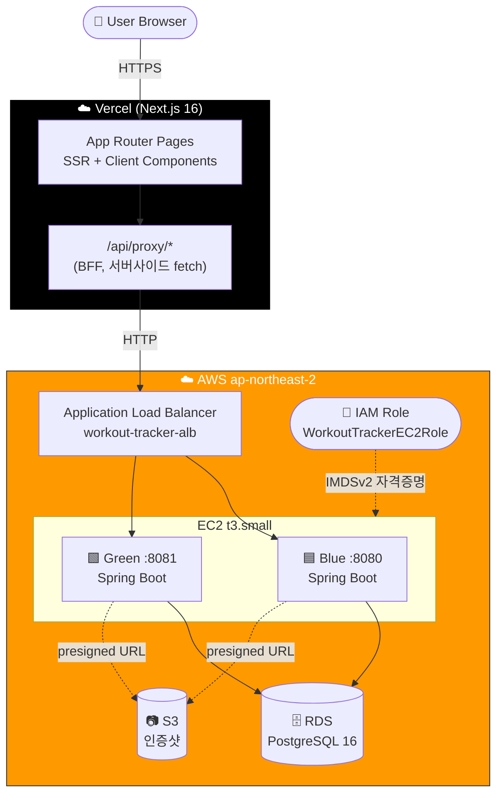
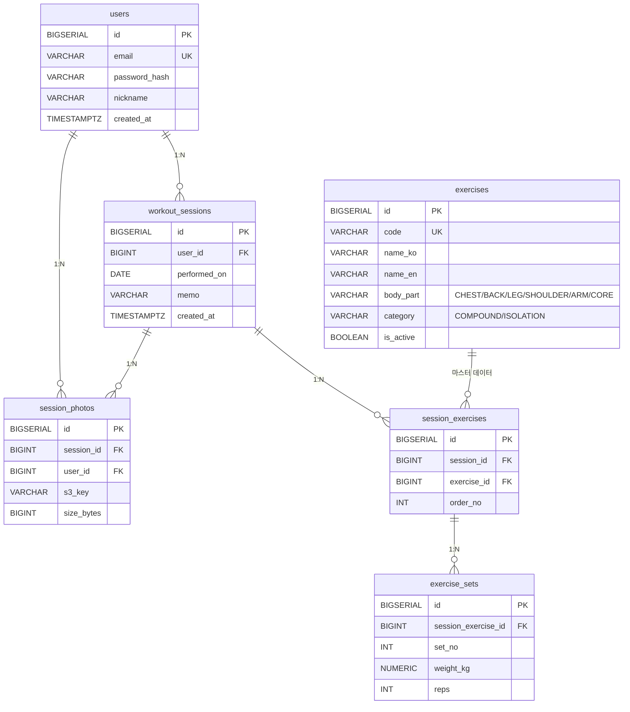

# workout-tracker


운동 세션/세트 기록 + 인증샷 업로드를 다루는 풀스택 MVP. 1주(40시간) 안에 면접 시연용으로 완성.

- Backend: Java 17 + Spring Boot 3.3 (REST API)
- Frontend: Next.js 16 (App Router) + TypeScript + Tailwind
- DB: PostgreSQL 16 (로컬은 docker-compose, 운영은 AWS RDS)
- 배포: **Vercel(FE BFF) + AWS EC2 Docker(BE Blue/Green) + ALB + RDS + S3**

상세 설계, 일정, 트레이드오프는 [`docs/design.md`](./docs/design.md)를 참고.

---

## 🌐 라이브 데모

| 항목 | URL |
|---|---|
| **Frontend (Vercel)** | https://workout-tracker-ten-zeta.vercel.app |
| Backend API | 비공개 (Vercel BFF → AWS ALB 경유로만 접근) |

> 데모 계정은 면접 시연 직전 별도 안내.

## 🏗️ 운영 아키텍처



핵심 운영 특성:
- **무중단 배포**: Blue/Green 2 컨테이너 + ALB Target Group + Rolling 스크립트 (`deploy/rolling-deploy.sh`)
- **시크릿 제로**: EC2 → S3 는 IAM Role (AccessKey 미사용), `.env` 에 DB/JWT 만
- **Mixed Content 회피**: 브라우저는 same-origin HTTPS, BFF 가 서버사이드 HTTP fetch
- **Backend 주소 은닉**: ALB DNS 는 Vercel 환경변수에만 존재, 클라이언트에 미노출

## 🗄️ 데이터 모델



- `ON DELETE CASCADE` 로 user/session 삭제 시 하위 데이터 자동 정리
- exercises 는 마스터 데이터 (12종 시드, V2 마이그레이션)
- exercise_sets 는 (session_exercise_id, set_no) 유니크 → 같은 운동 내 세트 번호 중복 방지

---

## 로컬 vs 운영 환경

| 항목 | 로컬 (local) | 운영 (prod) |
|---|---|---|
| 프로필 | `application-local.yml` | `application-prod.yml` |
| Spring Boot 실행 | `./gradlew bootRun` (호스트) | Docker 컨테이너 (`deploy/docker-compose.prod.yml`) |
| DB | `docker-compose.local.yml` 의 PostgreSQL 컨테이너 | AWS RDS PostgreSQL 16 |
| 이미지 저장소 | (사용 안 함 or 로컬 IAM 키) | AWS S3 (`<S3-BUCKET>`) |
| 시크릿 | `.env.local` (git 제외) | `deploy/.env` (git 제외) |
| 자동 재시작 | 수동 | `restart: unless-stopped` |

운영 배포 절차는 [`deploy/DEPLOY.md`](./deploy/DEPLOY.md) 참고.

---

## 로컬 실행 방법

사전 요구:

- Java 17 (Temurin/Adoptium 권장)
- Node.js 22 LTS 이상
- Docker Desktop

### 1) 환경변수 파일 준비

```bash
cp .env.local.example .env.local
# 필요 시 비밀번호 등 수정
```

### 2) DB + Adminer 기동

```bash
docker compose -f docker-compose.local.yml up -d
```

- PostgreSQL: `localhost:5432` (DB: `workout_tracker`, User: `workout`)
- Adminer: http://localhost:8081 (System=PostgreSQL, Server=postgres)

### 3) 백엔드 기동

```bash
cd backend
./gradlew bootRun         # macOS / Linux
gradlew.bat bootRun       # Windows
```

- 부트 시 Flyway가 `V1__init.sql`, `V2__seed_exercises.sql`을 자동 적용
- API: http://localhost:8080
- Swagger UI: http://localhost:8080/swagger-ui.html (Auth / Exercise / Session / Photo 전 엔드포인트 노출)

기본 프로필은 `local`. 다른 프로필을 쓰려면 `SPRING_PROFILES_ACTIVE=xxx` 환경변수.

### 4) 프론트엔드 기동

```bash
cd frontend
npm install
npm run dev
```

- http://localhost:3000 접속 → "workout-tracker" 텍스트 확인

### 5) 종료

```bash
docker compose -f docker-compose.local.yml down
# 데이터까지 삭제: docker compose -f docker-compose.local.yml down -v
```

---

## 디렉토리 구조 (요약)

```
workout-tracker/
├── backend/                       # Spring Boot
│   ├── Dockerfile                 # 멀티스테이지 (JDK17 → JRE Alpine, non-root)
│   ├── src/main/java/com/workouttracker/
│   │   ├── auth/  user/  exercise/  session/  photo/  common/  config/
│   │   └── WorkoutTrackerApplication.java
│   └── src/main/resources/
│       ├── application.yml
│       ├── application-{local,prod}.yml
│       └── db/migration/{V1__init.sql, V2__seed_exercises.sql}
├── frontend/                      # Next.js 16 (App Router)
│   ├── e2e/                       # Playwright 시나리오 (11개)
│   ├── playwright.config.ts
│   └── src/{app, components, features, lib, types, proxy.ts}
├── docs/
│   ├── design.md                  # 설계/일정 단일 소스
│   └── AWS_S3_SETUP.md            # S3 + IAM 셋업 가이드
├── deploy/                        # 운영 배포
│   ├── DEPLOY.md
│   ├── docker-compose.prod.yml    # Blue/Green 2 컨테이너
│   ├── rolling-deploy.sh          # 무중단 배포 스크립트
│   └── .env.example
├── .github/workflows/e2e.yml      # E2E CI (PostgreSQL + bootRun + Playwright)
├── docker-compose.local.yml
├── .env.local.example
└── README.md
```

전체 트리는 `docs/design.md` 부록 B 참고.

---

## 7일 일정 (진행 상황)

| Day | 내용 | 상태 |
|---|---|---|
| 1 | 인프라/뼈대 (스캐폴딩, Flyway, docker-compose) | ✅ |
| 2 | 인증 + 운동 종류 API | ✅ |
| 3 | 세션 도메인 (CRUD, 단일 트랜잭션) | ✅ |
| 4 | Frontend 인증/목록 + BFF 프록시 | ✅ |
| 5 | PR/통계 + S3 인증샷 (presigned URL) | ✅ |
| 6 | AWS 배포 (EC2/RDS/S3 + ALB Blue/Green + Vercel) | ✅ |
| 7 | E2E (Playwright 11 시나리오) + GitHub Actions CI + 문서화 | ✅ |

세부 내용은 [`docs/design.md`](./docs/design.md) 6장 참고. 운영 배포 상세는 [`deploy/DEPLOY.md`](./deploy/DEPLOY.md).

---

## 트러블슈팅

- `./gradlew bootRun` 시 DB 연결 에러 → `docker compose ps` 로 postgres 컨테이너 healthy 여부 확인
- 8080 포트 충돌 → Spring Boot가 사용하므로 다른 서비스 종료 또는 `server.port` 변경
- Flyway 마이그레이션 실패 후 재실행 → 개발 중이라면 `docker compose down -v` 로 볼륨 삭제 후 재기동
