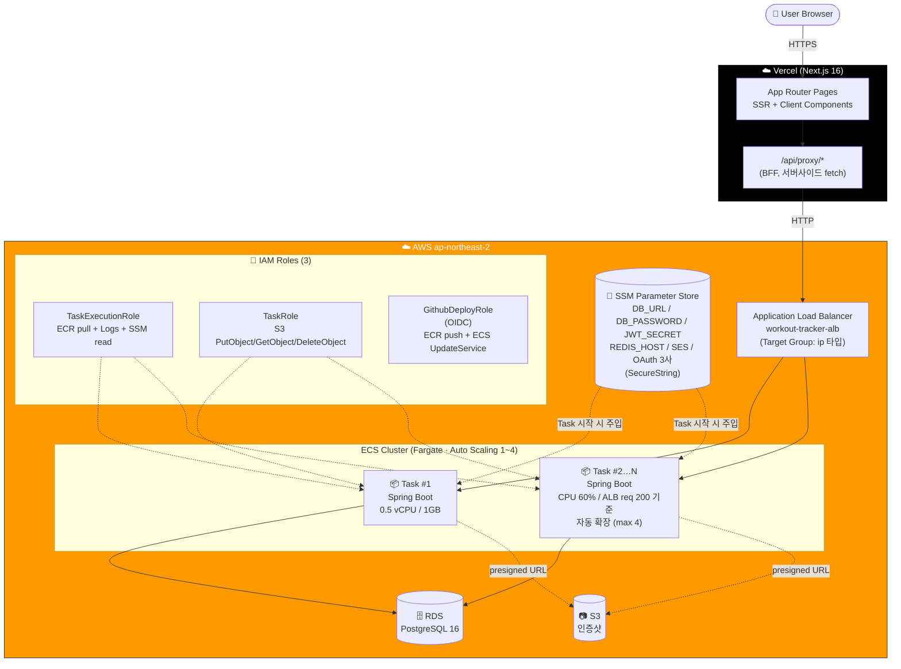
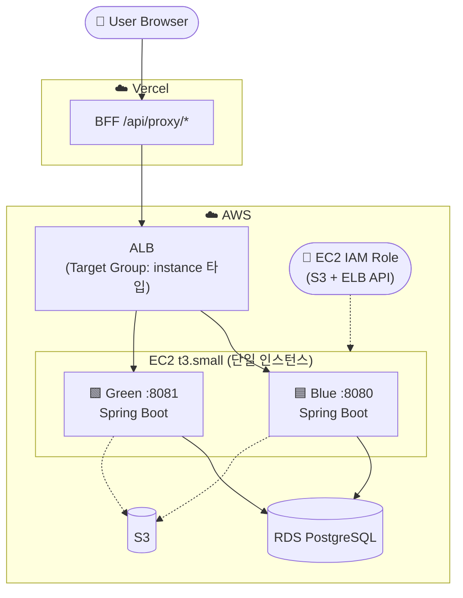
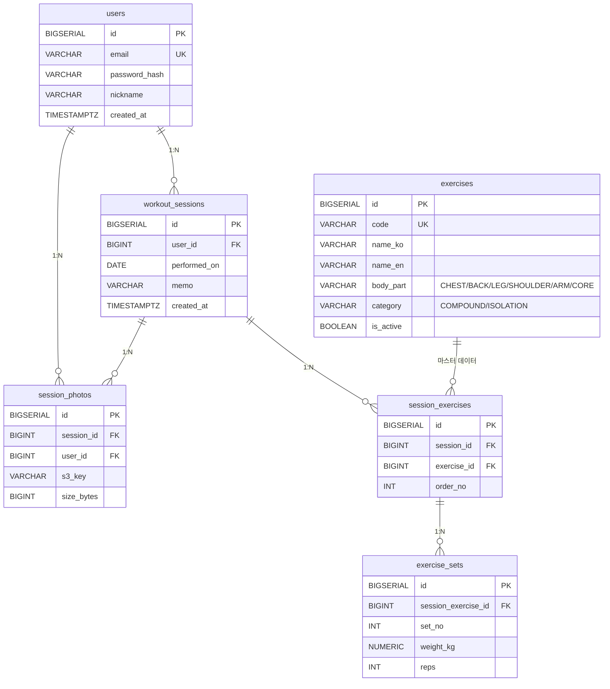

# workout-tracker


운동 세션/세트 기록 + 인증샷 업로드를 다루는 풀스택 MVP. AWS / Vercel / Spring Boot / Next.js 등 운영 스택을 실제로 다뤄보는 개인 학습 프로젝트.

- Backend: Java 17 + Spring Boot 3.3 (REST API)
- Frontend: Next.js 16 (App Router) + TypeScript + Tailwind
- DB: PostgreSQL 16 (로컬은 docker-compose, 운영은 AWS RDS)
- 배포: **Vercel(FE BFF) + AWS ECS Fargate(BE) + ALB + RDS + S3** (V1 EC2 Blue/Green 구조도 보존)

상세 설계, 일정, 트레이드오프는 [`docs/design.md`](./docs/design.md)를 참고.

---

## 🌐 라이브 사이트 (동작 중인 인스턴스)

| 항목 | URL |
|---|---|
| **Frontend (Vercel)** | https://workout-tracker-ten-zeta.vercel.app |
| Backend API | 비공개 (Vercel BFF → AWS ALB 경유로만 접근) |

> 회원가입은 누구나 가능. AWS 비용 절감 위해 비활성화될 수 있다.

## 🏗️ 운영 아키텍처 — V2 (현재, ECS Fargate)



V2 핵심 운영 특성:
- **서버리스 컨테이너**: Fargate — 인스턴스 패치/관리 불필요, 자동 자가 치유 (task 죽으면 ECS 가 재시작)
- **Rolling Update 표준**: `maximumPercent=200%` 로 새 task 2개 띄운 후 옛 task 종료 (다운타임 0초)
- **OIDC 기반 배포**: GitHub Actions 가 long-lived AccessKey 없이 임시 자격증명 받아 ECR push + ECS UpdateService
- **시크릿 분리**: 모든 시크릿이 **SSM Parameter Store SecureString** 으로 분리 → Task Definition 에 ARN 만 참조, 컨테이너 시작 시 자동 주입. 코드/`.env`/GitHub 어디에도 평문 시크릿 없음.
- **최소 권한 원칙**: IAM Role 을 Task 실행용 / 애플리케이션용 / 배포용 3개로 분리. `iam:PassRole` 도 정확히 2개 Role 만 허용.
- **Target Type `ip`**: Fargate `awsvpc` 네트워크 모드 → 컨테이너마다 ENI 부여 → ALB 가 task IP 에 직접 라우팅 (instance 타입 X)

<details>
<summary><strong>📜 V1 (옛 EC2 + Docker Compose Blue/Green)</strong> 보기</summary>

V2 마이그레이션 전 구조 — 코드는 `deploy/docker-compose.prod.yml` + `deploy/rolling-deploy.sh` 로 보존.



| 특성 | V1 (EC2 + Compose) | V2 (ECS Fargate) |
|---|---|---|
| 인프라 관리 | EC2 패치 / docker 업그레이드 직접 | **불필요** (Fargate) |
| 자가 치유 | EC2 죽으면 끝 (SPOF) | Task 죽으면 자동 재시작, Multi-AZ |
| 배포 자동화 | bash 스크립트 (`rolling-deploy.sh`) 가 ALB API 직접 호출 | GitHub Actions → ECS UpdateService 자동 |
| 시크릿 | EC2 의 `.env` 파일 | **SSM Parameter Store SecureString** |
| 인증 | EC2 IAM Role (IMDSv2) | Task Role + Task Execution Role 분리 |
| ALB Target Type | `instance` (EC2 인스턴스) | `ip` (Fargate awsvpc ENI) |
| 비고 | Rolling 패턴의 핵심 메커니즘 직접 구현 | 운영 표준 패턴 (ECS) |

V1 도 코드 보존 — Rolling 스크립트의 deregister → drain → restart → register 흐름을 직접 짠 경험은 ECS Rolling Update 의 내부 동작 이해에 직결.

</details>

## 🗄️ 데이터 모델



- `ON DELETE CASCADE` 로 user/session 삭제 시 하위 데이터 자동 정리
- exercises 는 마스터 데이터 (12종 시드, V2 마이그레이션)
- exercise_sets 는 (session_exercise_id, set_no) 유니크 → 같은 운동 내 세트 번호 중복 방지

---

## 로컬 vs 라이브 환경

| 항목 | 로컬 (local) | 라이브 (V2 / V1 비교) |
|---|---|---|
| 프로필 | `application-local.yml` | `application-prod.yml` |
| Spring Boot 실행 | `./gradlew bootRun` (호스트) | V2: ECS Fargate Task / V1: Docker Compose 컨테이너 |
| DB | `docker-compose.local.yml` 의 PostgreSQL 컨테이너 | AWS RDS PostgreSQL 16 |
| 이미지 저장소 | (사용 안 함 or 로컬 IAM 키) | AWS S3 (`<S3-BUCKET>`) |
| 시크릿 | `.env.local` (git 제외) | V2: SSM Parameter Store SecureString / V1: `deploy/.env` |
| 자동 재시작 / 자가 치유 | 수동 | V2: ECS Service desired count 유지 / V1: `restart: unless-stopped` |

배포 절차는 [`deploy/DEPLOY.md`](./deploy/DEPLOY.md) 참고.

---

## 로컬 실행 방법

사전 요구:

- Java 17
- Node.js 22 LTS 이상
- Docker Desktop

### 1) 환경변수 파일 준비

```bash
cp .env.local.example .env.local
# 필요 시 비밀번호 등 수정
```

### 2) DB + Adminer 기동

```bash
docker compose -f docker-compose.local.yml up -d
```

- PostgreSQL: `localhost:5432` (DB: `workout_tracker`, User: `workout`)
- Adminer: http://localhost:8081 (System=PostgreSQL, Server=postgres)

### 3) 백엔드 기동

```bash
cd backend
./gradlew bootRun         # macOS / Linux
gradlew.bat bootRun       # Windows
```

- 부트 시 Flyway가 `V1__init.sql`, `V2__seed_exercises.sql`을 자동 적용
- API: http://localhost:8080
- Swagger UI: http://localhost:8080/swagger-ui.html (Auth / Exercise / Session / Photo 전 엔드포인트 노출)

기본 프로필은 `local`. 다른 프로필을 쓰려면 `SPRING_PROFILES_ACTIVE=xxx` 환경변수.

### 4) 프론트엔드 기동

```bash
cd frontend
npm install
npm run dev
```

- http://localhost:3000 접속 → "workout-tracker" 텍스트 확인

### 5) 종료

```bash
docker compose -f docker-compose.local.yml down
# 데이터까지 삭제: docker compose -f docker-compose.local.yml down -v
```

---

## 디렉토리 구조 (요약)

```
workout-tracker/
├── backend/                       # Spring Boot
│   ├── Dockerfile                 # 멀티스테이지 (JDK17 → JRE Alpine, non-root)
│   ├── src/main/java/com/workouttracker/
│   │   ├── auth/  user/  exercise/  session/  photo/  common/  config/
│   │   └── WorkoutTrackerApplication.java
│   └── src/main/resources/
│       ├── application.yml
│       ├── application-{local,prod}.yml
│       └── db/migration/{V1__init.sql, V2__seed_exercises.sql}
├── frontend/                      # Next.js 16 (App Router)
│   ├── e2e/                       # Playwright 시나리오 (11개)
│   ├── playwright.config.ts
│   └── src/{app, components, features, lib, types, proxy.ts}
├── docs/
│   ├── design.md                  # 설계/일정 단일 소스
│   └── AWS_S3_SETUP.md            # S3 + IAM 셋업 가이드
├── deploy/                        # 배포 자산
│   ├── DEPLOY.md                  # V1/V2 배포 가이드 + 5가지 마이그레이션 함정
│   ├── docker-compose.prod.yml    # V1: EC2 Blue/Green 2 컨테이너
│   ├── rolling-deploy.sh          # V1: 무중단 배포 스크립트
│   ├── .env.example
│   └── ecs/                       # V2: ECS Fargate 자산
│       ├── README.md              # ECS 셋업 가이드 + 실전 함정 정리
│       ├── task-definition.json   # placeholder 치환형 Task Definition
│       └── iam/                   # 3종 IAM Role 의 trust / inline policy JSON
├── .github/workflows/
│   ├── e2e.yml                    # E2E CI (PostgreSQL + bootRun + Playwright)
│   └── deploy-ecs.yml             # V2 자동 배포 (OIDC → ECR → ECS UpdateService)
├── docker-compose.local.yml
├── .env.local.example
└── README.md
```

전체 트리는 `docs/design.md` 부록 B 참고.

---

## 구현 단계 (Phase)

| Phase | 내용 | 상태 |
|---|---|---|
| 1 | 인프라/뼈대 (스캐폴딩, Flyway, docker-compose) | ✅ |
| 2 | 인증 + 운동 종류 API | ✅ |
| 3 | 세션 도메인 (CRUD, 단일 트랜잭션) | ✅ |
| 4 | Frontend 인증/목록 + BFF 프록시 | ✅ |
| 5 | PR/통계 + S3 인증샷 (presigned URL) | ✅ |
| 6 | AWS 배포 V1 (EC2/RDS/S3 + ALB Blue/Green + Vercel) | ✅ |
| 7 | E2E (Playwright 11 시나리오) + GitHub Actions CI + 문서화 | ✅ |
| 8 | **V1 → V2 마이그레이션** (ECS Fargate + ECR + SSM Parameter Store + 3 IAM Role + OIDC + GitHub Actions 자동 배포) | ✅ |
| 9 | **인증 고도화** (D.1 Access+Refresh JWT + Redis 회전/재사용탐지 · D.2 이메일 인증 6자리코드 + SES · D.3 OAuth 소셜로그인 **구글·네이버·카카오** 3사) | ✅ |
| 10 | **ECS 오토스케일링 + 부하 테스트** (Application Auto Scaling — CPU 60% + ALB 요청수/타겟 200 다중 정책 · k6 부하 **18만 요청 무중단**, 1→4 스케일아웃 실측) | ✅ |

세부 내용은 [`docs/design.md`](./docs/design.md) 6장 참고. 인증 고도화 로드맵은 [`docs/design.md`](./docs/design.md) 부록 D. 배포 절차 / V1→V2 마이그레이션 함정 5가지는 [`deploy/DEPLOY.md`](./deploy/DEPLOY.md). 오토스케일링 구성·부하 테스트 결과는 [`deploy/AUTOSCALING.md`](./deploy/AUTOSCALING.md).

---

## 트러블슈팅

- `./gradlew bootRun` 시 DB 연결 에러 → `docker compose ps` 로 postgres 컨테이너 healthy 여부 확인
- 8080 포트 충돌 → Spring Boot가 사용하므로 다른 서비스 종료 또는 `server.port` 변경
- Flyway 마이그레이션 실패 후 재실행 → 개발 중이라면 `docker compose down -v` 로 볼륨 삭제 후 재기동
