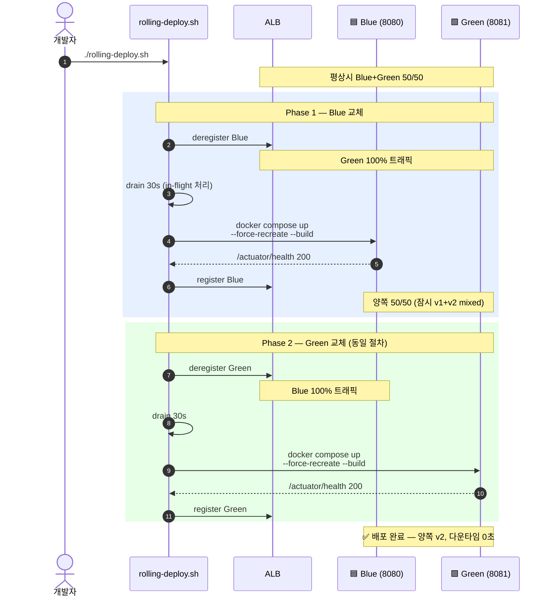
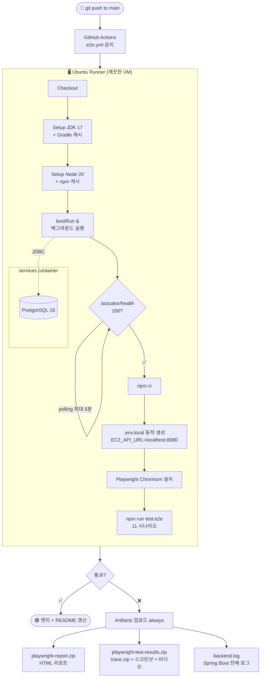
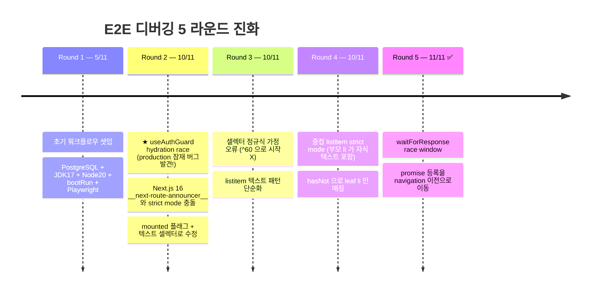
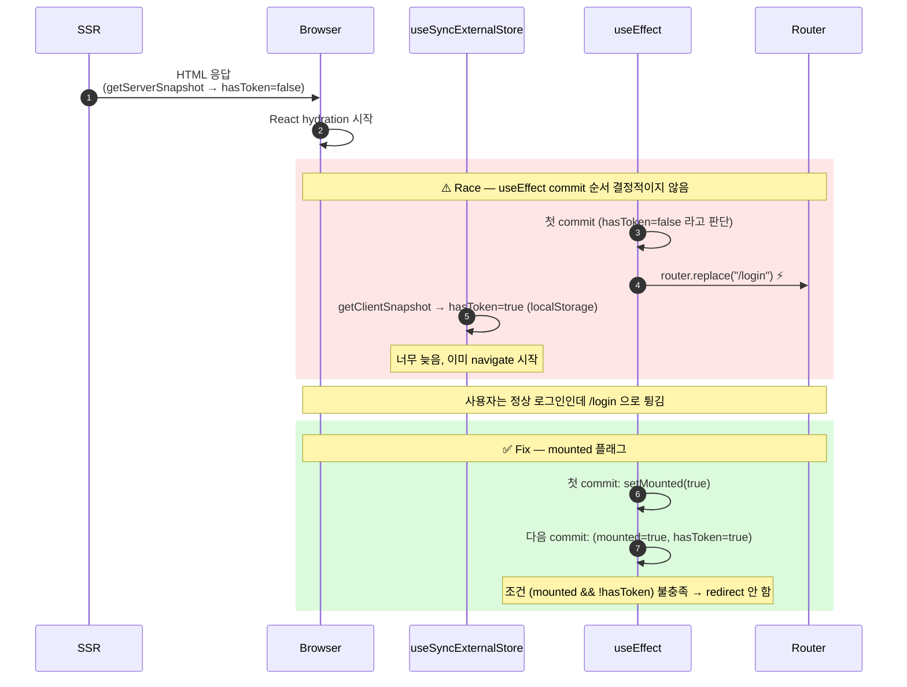

# workout-tracker 배포 가이드

| 컴포넌트 | 실체 |
|---|---|
| Frontend | Vercel (Next.js 16, BFF 패턴) — https://workout-tracker-ten-zeta.vercel.app |
| Backend | AWS EC2 t3.small (Amazon Linux 2023) — Docker Blue/Green 2 컨테이너 |
| Load Balancer | AWS ALB (`workout-tracker-alb`) + Target Group (`workout-tracker-tg`) |
| DB | AWS RDS PostgreSQL 16 |
| 스토리지 | AWS S3 (`<S3-BUCKET>`) |
| 인증 | EC2 IAM Role (`WorkoutTrackerEC2Role`) — AccessKey 미사용 |
| 배포 | git pull → `rolling-deploy.sh` (Blue → Green 순 무중단 교체) |

## 진행한 Phase 요약

| Phase | 내용 | 상태 |
|---|---|---|
| 6.1 | RDS PostgreSQL 생성 + SG 설정 | ✅ |
| 6.2 | Spring Boot 컨테이너 단일 배포 | ✅ |
| 6.3 | EC2 IAM Role 부착, AccessKey 환경변수 제거 | ✅ |
| 6.4 | ALB + Target Group + Blue/Green 2 컨테이너 + Rolling 배포 스크립트 | ✅ |
| 6.5 | Vercel 프론트엔드 배포 (BFF 환경변수 연동) | ✅ |
| 7   | Playwright E2E 11 시나리오 (+ S3 업로드 1건 `test.fixme` 스킵) + GitHub Actions CI 자동화 | ✅ |

---

## 1. 초기 셋업 (최초 1회)

### 1.1 소스 체크아웃

```bash
mkdir -p ~/projects
cd ~/projects
git clone <레포 URL> workout-tracker
cd workout-tracker
```

### 1.2 .env 작성

```bash
cp deploy/.env.example deploy/.env
nano deploy/.env
```

채워야 할 값 (Phase 6.3 IAM Role 적용 후 기준):

| 항목 | 값 | 비고 |
|---|---|---|
| `DB_URL` | RDS JDBC URL | `jdbc:postgresql://<RDS-ENDPOINT>:5432/workout_tracker` |
| `DB_USERNAME` | RDS 마스터 사용자명 | 기본 `workout` |
| `DB_PASSWORD` | RDS 마스터 비밀번호 | RDS 생성 시 설정한 값 |
| `JWT_SECRET` | 64자 이상 랜덤 문자열 | `openssl rand -base64 64` 로 생성 |
| `AWS_REGION` | AWS 리전 | 기본 `ap-northeast-2` |
| `AWS_S3_BUCKET` | S3 버킷명 | 부트 시 필수 (default 없음) |

> `AWS_ACCESS_KEY_ID` / `AWS_SECRET_ACCESS_KEY` 는 **불필요**. EC2 인스턴스에 `WorkoutTrackerEC2Role` IAM Role 이 부착되어 S3 SDK 가 IMDS 에서 임시 자격증명을 자동 획득한다.

### 1.3 보안 점검

```bash
# .env 파일 권한 600 으로 (소유자만 읽기/쓰기)
chmod 600 deploy/.env

# .env 가 git 추적 대상이 아닌지 확인
git status   # deploy/.env 가 안 나와야 정상
```

---

## 2. 빌드 + 기동

```bash
cd ~/projects/workout-tracker/deploy

# 빌드 + 백그라운드 기동
docker compose --env-file .env -f docker-compose.prod.yml up -d --build

# 처음 빌드는 Gradle 의존성 다운로드로 5~10분 소요 가능
# t3.small 메모리 (2GB) 한계로 빌드 중 OOM 발생 시 swap 추가 권장:
#   sudo dd if=/dev/zero of=/swapfile bs=1M count=2048
#   sudo chmod 600 /swapfile
#   sudo mkswap /swapfile && sudo swapon /swapfile
```

---

## 3. 로그 확인

```bash
# 컨테이너 로그 실시간 추적
docker compose -f docker-compose.prod.yml logs -f workout-tracker-backend

# 또는 컨테이너 이름으로 직접
docker logs -f workout-tracker-backend

# 최근 100줄만
docker logs --tail 100 workout-tracker-backend
```

부팅 성공 신호:

- `Started WorkoutTrackerApplication in N seconds` (Spring Boot 기동 완료)
- `Flyway: Successfully validated N migrations` (DB 연결 + 마이그레이션 OK)
- `Tomcat started on port(s): 8080` (HTTP 리스닝)

---

## 4. 재시작 / 중지

```bash
# 재시작
docker compose -f docker-compose.prod.yml restart

# 중지 + 컨테이너 제거 (이미지는 유지)
docker compose -f docker-compose.prod.yml down

# 중지 + 컨테이너 + 이미지 제거 (디스크 정리)
docker compose -f docker-compose.prod.yml down --rmi local
```

---

## 5. 업데이트 배포 (소스 변경 시)

### 5.1 무중단 (권장) — `rolling-deploy.sh`

```bash
cd ~/workout-tracker/deploy
./rolling-deploy.sh
```



자동 실행 흐름:

1. `git pull` (최신 코드)
2. Blue 컨테이너를 ALB Target Group 에서 deregister → 트래픽 차단
3. drain 30초 대기 (in-flight 요청 처리 완료)
4. Blue 컨테이너 새 이미지로 재시작
5. 호스트 헬스체크 통과 대기 (`/actuator/health` 200)
6. Blue 다시 register → ALB healthy 확인
7. Green 에 동일 절차 반복

전체 소요: 약 5~7 분. **중간에 ALB 가 한 컨테이너로 모든 트래픽을 라우팅하므로 다운타임 0초.**

> 시연 검증: 다른 터미널에서 `watch -n 1 'curl -s -o /dev/null -w "%{http_code}\n" http://<ALB-DNS>/actuator/health'` 띄워두고 배포 중 200 응답 유지 확인.

### 5.2 일괄 재시작 (다운타임 허용 시)

```bash
cd ~/workout-tracker
git pull
cd deploy
docker compose --env-file .env -f docker-compose.prod.yml up -d --build
```

두 컨테이너 동시 재기동 → 부팅 동안 약 60~90초 다운.

---

## 6. 헬스체크 검증

```bash
# EC2 내부에서
curl http://localhost:8080/actuator/health
# 예상 응답: {"status":"UP"}

# 외부에서 (SG 8080 인바운드 허용 시)
curl http://<EC2_퍼블릭_IP>:8080/actuator/health

# 컨테이너 상태
docker compose -f docker-compose.prod.yml ps
# STATUS 가 (healthy) 이어야 정상
```

API 동작 확인:

```bash
# 회원가입
curl -X POST http://localhost:8080/api/v1/auth/signup \
  -H "Content-Type: application/json" \
  -d '{"email":"test@example.com","password":"Secret1234!","nickname":"test"}'

# 로그인 -> 토큰 확인
curl -X POST http://localhost:8080/api/v1/auth/login \
  -H "Content-Type: application/json" \
  -d '{"email":"test@example.com","password":"Secret1234!"}'
```

---

## 7. 트러블슈팅

### 7.1 빌드 실패 / OOM

t3.small 메모리(2GB)로 Gradle 빌드 중 OOM 가능:

```bash
# Gradle 캐시 정리
docker compose -f docker-compose.prod.yml build --no-cache

# 그래도 안 되면 swap 추가
sudo dd if=/dev/zero of=/swapfile bs=1M count=2048
sudo chmod 600 /swapfile
sudo mkswap /swapfile
sudo swapon /swapfile

# 영구화: /etc/fstab 에 추가
echo "/swapfile none swap sw 0 0" | sudo tee -a /etc/fstab
```

### 7.2 런타임 OOM

```bash
# 메모리 사용량 모니터링
docker stats workout-tracker-backend

# Dockerfile 의 JAVA_TOOL_OPTIONS 조정
# 현재: -Xmx384m -XX:MaxMetaspaceSize=128m
# 부족하면 mem_limit (docker-compose) 도 함께 증액
```

### 7.3 RDS 연결 실패

`HikariPool... Connection is not available` 또는 `Could not open JDBC Connection`:

```bash
# 1) SG 확인: RDS SG 인바운드 5432 에 EC2 SG 가 허용되어야 함
#    AWS Console -> RDS -> 인스턴스 -> Connectivity & security -> VPC security groups
# 2) RDS 엔드포인트가 .env 의 DB_URL 과 일치하는지
# 3) 마스터 사용자명/비밀번호 일치하는지
# 4) DB 존재 여부 (workout_tracker 데이터베이스)
psql -h <RDS_ENDPOINT> -U workout -d workout_tracker
# RDS 엔드포인트는 AWS Console → RDS → 인스턴스 → "Endpoint & port" 에서 확인
```

### 7.4 Flyway 실패

마이그레이션 충돌 시:

```bash
# 컨테이너에 접속해서 Flyway 상태 확인
docker exec -it workout-tracker-backend sh
# 안에서:
# tail /app/app.log 또는 docker logs 로 어느 V__파일 충돌인지 확인
```

### 7.5 S3 / IAM 에러

`software.amazon.awssdk.services.s3.model.S3Exception: Access Denied`:

- EC2 인스턴스에 `WorkoutTrackerEC2Role` IAM Role 이 부착됐는지 (Console → EC2 → 인스턴스 → 보안 → IAM 역할)
- 해당 Role 에 `s3:PutObject`, `s3:GetObject`, `s3:DeleteObject` 권한 있는지 (`<S3-BUCKET>/*`)
- IMDSv2 토큰으로 자격증명 확인:
  ```bash
  TOKEN=$(curl -X PUT "http://169.254.169.254/latest/api/token" \
    -H "X-aws-ec2-metadata-token-ttl-seconds: 60")
  curl -H "X-aws-ec2-metadata-token: $TOKEN" \
    http://169.254.169.254/latest/meta-data/iam/security-credentials/
  ```
- 버킷 region 이 `ap-northeast-2` 인지 (region 불일치 시 SignatureDoesNotMatch)

### 7.6 컨테이너가 (unhealthy) 로 표시

```bash
# healthcheck 로그 확인
docker inspect workout-tracker-backend --format '{{json .State.Health}}' | jq

# 가장 흔한 원인:
# - DB 연결 실패로 Spring Boot 부팅 자체 실패 (Actuator 응답 안 함)
# - start_period 60s 보다 부팅이 더 오래 걸림 (대용량 의존성 + cold JVM)
```

---

## 8. IAM Role (Phase 6.3) 권한 구성

EC2 인스턴스에 부착된 IAM Role: `WorkoutTrackerEC2Role`

| 정책 | Action | Resource | 용도 |
|---|---|---|---|
| inline `workout-tracker-s3` | `s3:PutObject`, `s3:GetObject`, `s3:DeleteObject` | `arn:aws:s3:::<S3-BUCKET>/*` | 인증샷 업로드/다운로드 presigned URL 서명 + 세션 삭제 시 S3 객체 정리 |
| inline `workout-tracker-elb-rolling-deploy` | `elasticloadbalancing:DescribeTargetGroups`, `DescribeTargetHealth`, `RegisterTargets`, `DeregisterTargets` | `*` (TG 1개라 좁힐 의미 적음) | Rolling 배포 스크립트가 ALB 조작 |

IAM Role 부착 후:
- `.env` 에서 `AWS_ACCESS_KEY_ID`, `AWS_SECRET_ACCESS_KEY` 제거 가능
- AWS SDK 가 `DefaultCredentialsProvider` 로 IMDS (`169.254.169.254`) 에서 임시 자격증명 자동 획득
- 자격증명 회전 자동, 누출 위험 감소

## 9. ALB / Target Group (Phase 6.4)

| 항목 | 값 |
|---|---|
| ALB 이름 | `workout-tracker-alb` |
| ALB DNS | `<ALB-DNS>` (실제 값은 `.env` / Vercel 환경변수에만) |
| Target Group | `workout-tracker-tg` (HTTP/8080, target type=instance) |
| 등록 대상 | 같은 EC2 인스턴스 (`<EC2_INSTANCE_ID>`) 의 8080 / 8081 두 포트 |
| 헬스체크 경로 | `/actuator/health` (HTTP 200 기대) |
| 헬스체크 주기 | 30초, 임계값 healthy/unhealthy 모두 2 |

### 보안 그룹 인바운드

| SG | 인바운드 | 출처 |
|---|---|---|
| `alb-sg` | TCP 80 | 0.0.0.0/0 (인터넷) |
| `web-sg` (EC2) | TCP 8080, 8081 | `alb-sg` (Source SG 지정, CIDR 아님) |
| `db-sg` (RDS) | TCP 5432 | `web-sg` |

> `web-sg` 인바운드를 ALB SG 로만 좁힌 결과, EC2 퍼블릭 IP 로 직접 8080/8081 접근 불가 → **ALB 만이 유일한 진입점**.

## 10. Vercel (Phase 6.5)

| 항목 | 값 |
|---|---|
| Project | `workout-tracker` |
| Root Directory | `frontend/` (모노레포라 명시) |
| Framework | Next.js 16 (자동 감지) |
| 환경변수 `EC2_API_URL` | `http://<ALB-DNS>` |
| 환경변수 `NEXT_PUBLIC_API_BASE_URL` | `/api/proxy` |

브라우저 → Vercel HTTPS → 서버사이드 fetch → ALB HTTP. **서버사이드 호출은 CORS 무관**, Mixed Content 발생 안 함.

---

## 11. GitHub Actions E2E CI (Phase 7)

### 11.1 워크플로우 구성

| 항목 | 값 |
|---|---|
| 파일 | `.github/workflows/e2e.yml` |
| Runner | `ubuntu-latest` (GitHub-hosted) |
| 트리거 | `push` to `main`, `pull_request` to `main`, `workflow_dispatch` (수동) |
| 시간 | 약 3~4 분 (캐시 적중 시) / 8~10 분 (첫 실행) |

### 11.2 실행 흐름



### 11.3 환경변수

워크플로우 job 레벨에 정의 (GitHub Secrets 불필요 — 모두 로컬 더미값):

```yaml
env:
  DB_URL: jdbc:postgresql://localhost:5432/workout_tracker
  DB_USERNAME: workout
  DB_PASSWORD: workout_pw_local
  JWT_SECRET: ci-dummy-secret-at-least-32-characters-long-for-hs256-algorithm-OK
  SPRING_PROFILES_ACTIVE: local
  CI: "true"
```

AWS S3 자격증명은 의도적으로 미주입. 사진 업로드 시나리오는 `test.fixme` 로 스킵 처리되어 CI 에서는 호출되지 않음.

### 11.4 모니터링 / 결과 확인

```bash
# 최근 실행 목록
gh run list --workflow=e2e.yml --limit 5

# 진행 중 실행 실시간 watch
gh run watch <RUN_ID> --exit-status

# 특정 실행 상세 (실패 step 확인)
gh run view <RUN_ID> --log-failed

# artifact 다운로드 (실패 디버깅)
gh run download <RUN_ID>
```

또는 브라우저: `https://github.com/<owner>/<repo>/actions`

### 11.5 실패 시 디버깅 절차

1. **Artifact 다운로드** → `playwright-report.zip` 압축 해제 → `index.html` 열기
2. 실패한 테스트에서 **Trace** 버튼 → Time-travel DOM snapshot 으로 시점별 상태 확인
3. `playwright-test-results/<test>/error-context.md` 가 자동 생성 — 페이지 snapshot + Test source + Error details 한 곳에 정리
4. 백엔드가 원인일 가능성이 있으면 `backend.log` 확인 (Spring Boot 전체 로그)

### 11.6 trace 보는 법

```bash
cd frontend
npx playwright show-trace <path/to/trace.zip>
```

또는 HTML 리포트에서 실패 테스트의 "Trace" 버튼 클릭 → 브라우저에서 즉시 열림.

Trace Viewer 가 보여주는 것:
- **Actions timeline** — 각 click/fill 시점
- **DOM snapshot** — 그 시점의 페이지 상태 (이전/이후 비교 가능)
- **Network** — 요청/응답 헤더와 본문
- **Console** — 브라우저 콘솔 메시지
- **Source** — 실패 라인이 강조된 테스트 코드

### 11.7 5 라운드 디버깅 사례 (실제 진행 기록)



| 라운드 | 통과/실패 | 원인 | Fix |
|---|---|---|---|
| 1 | 5/11 | 초기 셋업 | 워크플로우 파일 작성 |
| 2 | 10/11 | (1) `useAuthGuard` hydration race — 정상 로그인 사용자가 /login 으로 일시 튕김 (잠재 prod 버그) (2) Next.js 16 의 `__next-route-announcer__` 와 `getByRole("alert")` strict mode 충돌 | (1) `mounted` 플래그로 client mount 보장 (2) `getByText` 로 변경 |
| 3 | 10/11 | 셀렉터 정규식 가정 오류 (`^60` 으로 시작) | 셀렉터 단순화 |
| 4 | 10/11 | 중첩 listitem strict mode (부모 li 가 자식 텍스트 포함) | `hasNot` 으로 leaf li 만 매칭 |
| 5 | **11/11 ✅** | `waitForResponse` promise 등록이 fetch 시작 후라 응답 missed | promise 를 navigation 이전에 등록 |

#### Round 2 핵심: hydration race (production 잠재 버그)

E2E 가 노출한 진짜 prod 버그. `useSyncExternalStore` 의 `getServerSnapshot` 이 항상 false 라 hydration 첫 commit 에서 정상 로그인 사용자도 일시적으로 /login 으로 튕길 수 있는 race:



### 11.8 Deprecation 알림 (2026-09-16 까지 대응 필요)

Action 들이 Node.js 20 런타임 위에서 동작 중. 2026-09-16 이후 강제 제거. 대응 옵션:

- **Opt-in 즉시**: workflow 의 `env:` 에 `FORCE_JAVASCRIPT_ACTIONS_TO_NODE24: "true"` 추가
- **버전 업그레이드 대기**: `actions/checkout@v5` 등 Node 24 지원 버전 출시 시 교체

---

## 부록. 자주 쓰는 명령어 모음

```bash
# 컨테이너 셸 진입
docker exec -it workout-tracker-backend sh

# 컨테이너 환경변수 확인 (시크릿 노출 주의)
docker exec workout-tracker-backend env | grep -v PASSWORD | grep -v SECRET

# 이미지 크기 확인
docker images | grep workout-tracker

# 사용 안 하는 이미지/캐시 정리 (디스크 가득 찼을 때)
docker system prune -a --volumes
```
