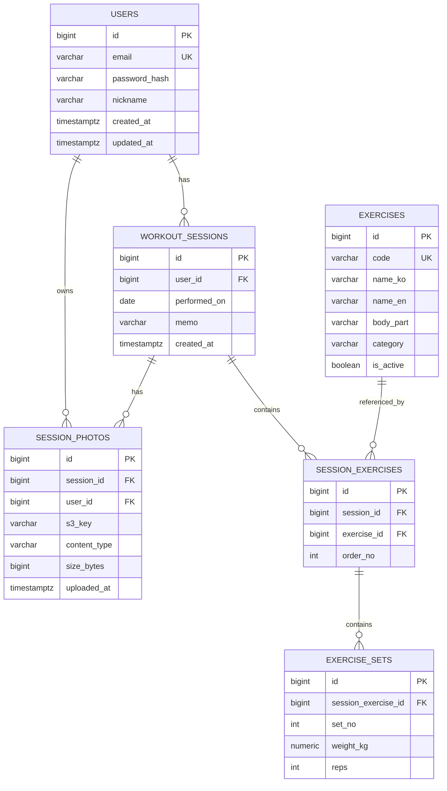
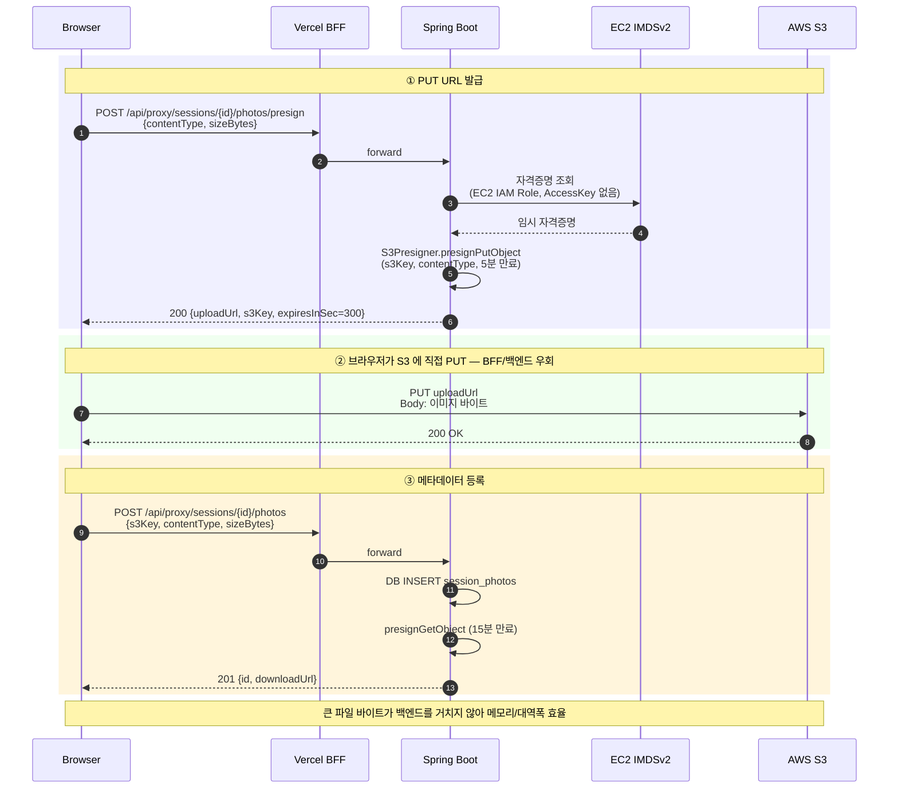
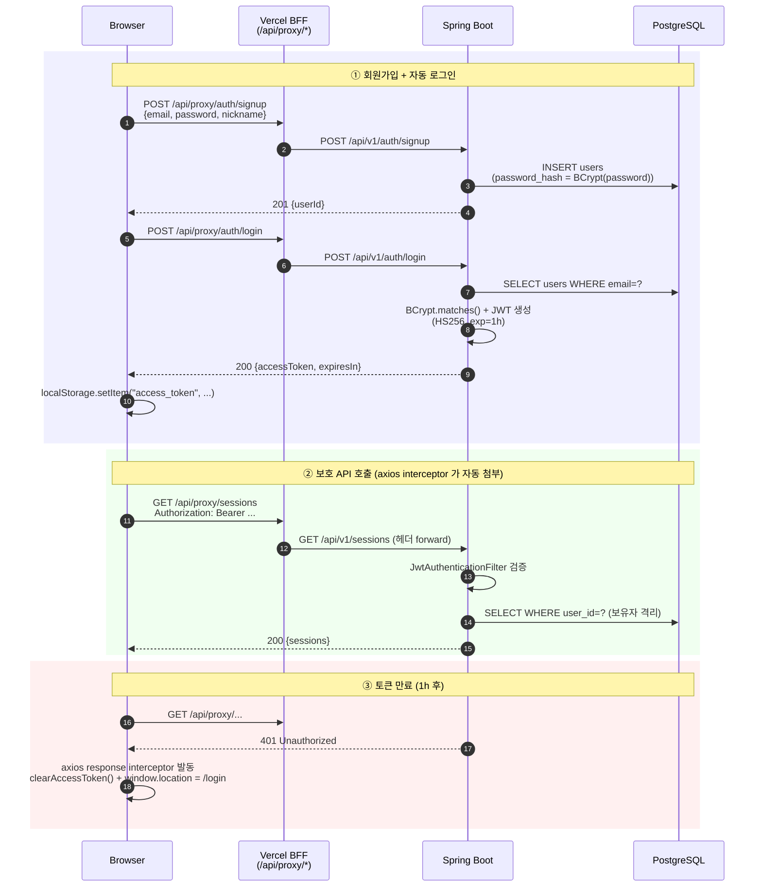

# workout-tracker MVP 설계 문서

> 목적: AWS / Vercel / Spring Boot / Next.js 등 풀스택 운영 스택을 실제로 다뤄보는 개인 학습 프로젝트
> 범위: MVP 1세트 (배포 + E2E 자동화 포함)

---

## 0. 요약

- 도메인: 운동 세션/세트 기록 + 인증샷 업로드 (간단한 1인 사용 도메인)
- 아키텍처: Browser -> Vercel(Next.js, BFF) -> EC2(Spring Boot in Docker) -> RDS(PostgreSQL), 이미지는 S3 presigned URL
- BFF 패턴: Vercel의 Next.js API Route가 EC2로 서버사이드 프록시 (Mixed Content 회피 + EC2 IP 은닉)
- 핵심 트레이드오프:
  - 단순함 우선: 모놀리식 Spring Boot 1개 + Next.js 1개. MSA/큐/캐시는 모두 제외
  - 데이터 정합성 우선: 세션-세트 저장은 단일 트랜잭션, 동시성 충돌이 거의 없는 1인 사용 도메인이므로 락은 최소화
  - 학습효과 우선: Playwright / Next.js BFF / S3 presigned URL / AWS 인프라 (ALB Blue/Green, IAM Role) 등 주요 기술을 실제 코드로 다뤄보는 데 초점
  - 도메인 미구매 결정에 따라 Vercel 기본 도메인 + EC2 IP 직접 접근, HTTPS는 BFF로 해결

---

## 1. 기능 우선순위 매트릭스

### 1.1 MoSCoW 분류

| 우선순위 | 기능 | 예상 시간 | 비고 |
|---|---|---|---|
| Must | 회원가입/로그인 (JWT 발급/검증) | 4h | Spring Security + BCrypt |
| Must | 운동 종류 라이브러리 조회 (시드 데이터) | 1.5h | 읽기 전용, 캐시 가능 |
| Must | 운동 세션 + 세트 기록 (생성/조회/삭제) | 6h | 단일 트랜잭션 핵심 기능 |
| Must | 운동 기록 목록 페이징 조회 | 2h | 날짜 역순, Slice 기반 |
| Must | Next.js 페이지 + React Query 통합 | 6h | 인증/세션 폼/리스트 |
| Must | EC2 Docker 배포 + Vercel 배포 + RDS 연결 | 4h | docker-compose, GitHub Actions |
| Should | 운동별 PR(최고 무게) / 최근 기록 | 2h | 집계 쿼리 |
| Should | 인증샷 S3 presigned URL 업로드 | 3h | PUT presigned, 메타데이터만 DB |
| Should | Playwright E2E (로그인 -> 기록 -> 조회) | 3h | 시나리오 2~3개 |
| Should | Swagger/OpenAPI 문서 자동화 | 1h | springdoc-openapi |
| Could | 주간 통계 (총 볼륨 = 무게×횟수 합계) | 2h | 시간 남으면 |
| Could | 소셜 로그인 (Google OAuth) | 4h | 제외 권장 |
| Could | 이미지 썸네일 (Lambda) | - | 제외 |

---

## 2. DB 스키마

### 2.1 ER 다이어그램 (Mermaid)



### 2.2 DDL (PostgreSQL 16)

```sql
-- =========================================
-- users
-- =========================================
CREATE TABLE users (
    id              BIGSERIAL PRIMARY KEY,
    email           VARCHAR(255) NOT NULL UNIQUE,
    password_hash   VARCHAR(100) NOT NULL,
    nickname        VARCHAR(50)  NOT NULL,
    created_at      TIMESTAMPTZ  NOT NULL DEFAULT NOW(),
    updated_at      TIMESTAMPTZ  NOT NULL DEFAULT NOW()
);
CREATE INDEX idx_users_email ON users (LOWER(email));

-- =========================================
-- exercises (마스터 데이터)
-- =========================================
CREATE TABLE exercises (
    id          BIGSERIAL PRIMARY KEY,
    code        VARCHAR(50)  NOT NULL UNIQUE,
    name_ko     VARCHAR(50)  NOT NULL,
    name_en     VARCHAR(80)  NOT NULL,
    body_part   VARCHAR(20)  NOT NULL,
    category    VARCHAR(20)  NOT NULL,
    is_active   BOOLEAN      NOT NULL DEFAULT TRUE
);
CREATE INDEX idx_exercises_body_part ON exercises (body_part) WHERE is_active = TRUE;

-- =========================================
-- workout_sessions
-- =========================================
CREATE TABLE workout_sessions (
    id              BIGSERIAL PRIMARY KEY,
    user_id         BIGINT      NOT NULL REFERENCES users(id) ON DELETE CASCADE,
    performed_on    DATE        NOT NULL,
    memo            VARCHAR(500),
    created_at      TIMESTAMPTZ NOT NULL DEFAULT NOW()
);
CREATE INDEX idx_sessions_user_date ON workout_sessions (user_id, performed_on DESC, id DESC);

-- =========================================
-- session_exercises
-- =========================================
CREATE TABLE session_exercises (
    id          BIGSERIAL PRIMARY KEY,
    session_id  BIGINT NOT NULL REFERENCES workout_sessions(id) ON DELETE CASCADE,
    exercise_id BIGINT NOT NULL REFERENCES exercises(id),
    order_no    INT    NOT NULL,
    UNIQUE (session_id, order_no)
);
CREATE INDEX idx_session_exercises_session ON session_exercises (session_id);
CREATE INDEX idx_session_exercises_exercise ON session_exercises (exercise_id);

-- =========================================
-- exercise_sets
-- =========================================
CREATE TABLE exercise_sets (
    id                   BIGSERIAL PRIMARY KEY,
    session_exercise_id  BIGINT  NOT NULL REFERENCES session_exercises(id) ON DELETE CASCADE,
    set_no               INT     NOT NULL,
    weight_kg            NUMERIC(6, 2) NOT NULL CHECK (weight_kg >= 0),
    reps                 INT     NOT NULL CHECK (reps > 0),
    UNIQUE (session_exercise_id, set_no)
);
CREATE INDEX idx_exercise_sets_weight ON exercise_sets (session_exercise_id, weight_kg DESC);

-- =========================================
-- session_photos
-- =========================================
CREATE TABLE session_photos (
    id            BIGSERIAL PRIMARY KEY,
    session_id    BIGINT      NOT NULL REFERENCES workout_sessions(id) ON DELETE CASCADE,
    user_id       BIGINT      NOT NULL REFERENCES users(id) ON DELETE CASCADE,
    s3_key        VARCHAR(300) NOT NULL,
    content_type  VARCHAR(50)  NOT NULL,
    size_bytes    BIGINT       NOT NULL CHECK (size_bytes > 0 AND size_bytes <= 10485760),
    uploaded_at   TIMESTAMPTZ  NOT NULL DEFAULT NOW()
);
CREATE INDEX idx_photos_session ON session_photos (session_id);
```

### 2.3 인덱스 전략 요약

| 인덱스 | 목적 | 비고 |
|---|---|---|
| idx_sessions_user_date | 메인 리스트 페이징의 핵심 | (user_id, performed_on DESC, id DESC) 복합. id를 tiebreaker로 - 키셋 페이징 가능 |
| idx_session_exercises_exercise | PR/히스토리 집계 | exercise 단위 조회 |
| idx_exercise_sets_weight | PR 1쿼리 추출 | MAX(weight_kg) 빠르게 |
| LOWER(email) 인덱스 | 대소문자 무관 로그인 | 함수 인덱스 |

### 2.4 트랜잭션 경계

| 작업 | 트랜잭션 범위 | 이유 |
|---|---|---|
| 회원가입 | 단일 INSERT | 단순 |
| 세션 생성 | session -> session_exercises -> exercise_sets 모두 한 트랜잭션 | 부분 저장 시 데이터 정합성 깨짐 |
| 세션 삭제 | CASCADE로 자동 | DB 레벨 보장 |
| 인증샷 업로드 | 메타데이터 INSERT만 트랜잭션, S3 PUT은 클라이언트에서 직접 | presigned URL 방식이므로 분리 |

### 2.5 동시성 / 락 전략

- 기본 전략: 1인 사용자가 자기 데이터만 다루는 도메인 -> 락 거의 불필요
- PR 조회: 읽기 일관성만 필요 -> 락 없음, READ COMMITTED 기본값
- 세션 생성 중 동일 user_id가 동시 요청: 거의 발생 안 함. 발생해도 별개 세션이라 무방
- 명시적 락이 필요한 가상 시나리오 (확장 포인트로만 언급): 추후 친구/그룹 기능 추가 시 그룹 멤버십 검사에 비관적 락 고려

### 2.6 시드 데이터 (운동 종류 12개)

```sql
INSERT INTO exercises (code, name_ko, name_en, body_part, category) VALUES
('BENCH_PRESS',     '벤치프레스',       'Bench Press',          'CHEST',    'COMPOUND'),
('INCLINE_DB_PRESS','인클라인 덤벨프레스','Incline Dumbbell Press','CHEST',   'COMPOUND'),
('DEADLIFT',        '데드리프트',       'Deadlift',             'BACK',     'COMPOUND'),
('LAT_PULLDOWN',    '랫풀다운',         'Lat Pulldown',         'BACK',     'COMPOUND'),
('BARBELL_ROW',     '바벨로우',         'Barbell Row',          'BACK',     'COMPOUND'),
('SQUAT',           '바벨 스쿼트',      'Barbell Squat',        'LEG',      'COMPOUND'),
('LEG_PRESS',       '레그프레스',       'Leg Press',            'LEG',      'COMPOUND'),
('OHP',             '오버헤드프레스',   'Overhead Press',       'SHOULDER', 'COMPOUND'),
('LATERAL_RAISE',   '사이드 레터럴',    'Lateral Raise',        'SHOULDER', 'ISOLATION'),
('BB_CURL',         '바벨컬',           'Barbell Curl',         'ARM',      'ISOLATION'),
('TRICEPS_PUSHDOWN','트라이셉스 푸시다운','Triceps Pushdown',    'ARM',      'ISOLATION'),
('PLANK',           '플랭크',           'Plank',                'CORE',     'ISOLATION');
```

> Flyway 또는 Spring Boot data.sql로 부트 시 자동 적재. ON CONFLICT DO NOTHING으로 멱등성 보장.

---

## 3. REST API 설계

### 3.1 공통 규약

- Base URL: `https://api.workout-tracker.example.com/api/v1`
- Content-Type: `application/json; charset=utf-8`
- 인증: `Authorization: Bearer <JWT>`
- 시간 포맷: ISO-8601 (`2026-05-16T10:30:00Z`)
- 페이징: 쿼리스트링 `?page=0&size=20` (Spring Pageable 표준), 응답은 `{ content, page, size, totalElements, hasNext }`

### 3.2 표준 에러 응답

```json
{
  "timestamp": "2026-05-16T10:30:00Z",
  "status": 400,
  "code": "VALIDATION_FAILED",
  "message": "weight_kg must be >= 0",
  "path": "/api/v1/sessions",
  "traceId": "abc123"
}
```

### 3.3 상태 코드 규칙

| 상태 | 사용처 |
|---|---|
| 200 | 조회/수정 성공 |
| 201 | 생성 성공 (Location 헤더 포함) |
| 204 | 삭제 성공 |
| 400 | 검증 실패 (Bean Validation) |
| 401 | 토큰 없음/만료/위변조 |
| 403 | 권한 없음 (남의 리소스 접근) |
| 404 | 리소스 없음 |
| 409 | 이메일 중복 등 비즈니스 충돌 |
| 500 | 서버 에러 |

### 3.4 엔드포인트 목록

| Method | Path | 인증 | 설명 |
|---|---|---|---|
| POST | /auth/signup | No | 회원가입 |
| POST | /auth/login | No | 로그인 (JWT 발급) |
| GET | /auth/me | Yes | 내 정보 |
| GET | /exercises | Yes | 운동 종류 목록 (body_part 필터) |
| POST | /sessions | Yes | 세션 + 세트 일괄 생성 |
| GET | /sessions | Yes | 내 세션 목록 (페이징) |
| GET | /sessions/{id} | Yes | 세션 상세 |
| DELETE | /sessions/{id} | Yes | 세션 삭제 |
| GET | /exercises/{id}/stats | Yes | 운동별 PR/최근 기록 |
| POST | /photos/presign | Yes | S3 PUT presigned URL 발급 |
| POST | /sessions/{id}/photos | Yes | 업로드 완료 후 메타데이터 등록 |

### 3.5 주요 엔드포인트 상세

#### POST /auth/signup
```json
// Request
{ "email": "kim@example.com", "password": "Secret1234!", "nickname": "kim" }
// Response 201
{ "userId": 1, "email": "kim@example.com", "nickname": "kim" }
```
- 검증: 이메일 형식, 비밀번호 8자+영문+숫자, 닉네임 2~20자
- 충돌: 이메일 중복 시 409 EMAIL_DUPLICATED

#### POST /auth/login
```json
// Request
{ "email": "kim@example.com", "password": "Secret1234!" }
// Response 200
{ "accessToken": "eyJ...", "tokenType": "Bearer", "expiresIn": 3600 }
```

#### POST /sessions (핵심: 단일 트랜잭션)
```json
// Request
{
  "performedOn": "2026-05-16",
  "memo": "가슴/삼두",
  "exercises": [
    {
      "exerciseId": 1,
      "orderNo": 1,
      "sets": [
        { "setNo": 1, "weightKg": 60.0, "reps": 10 },
        { "setNo": 2, "weightKg": 70.0, "reps": 8 }
      ]
    }
  ]
}
// Response 201, Location: /api/v1/sessions/123
{ "sessionId": 123 }
```

#### GET /sessions?page=0&size=20
```json
{
  "content": [
    {
      "id": 123,
      "performedOn": "2026-05-16",
      "memo": "가슴/삼두",
      "exerciseCount": 3,
      "totalSets": 9,
      "totalVolume": 4520.0,
      "photoCount": 1
    }
  ],
  "page": 0, "size": 20, "totalElements": 1, "hasNext": false
}
```

#### GET /exercises/{id}/stats
```json
{
  "exerciseId": 1,
  "name": "벤치프레스",
  "personalRecordKg": 100.0,
  "personalRecordDate": "2026-05-10",
  "recentSessions": [
    { "sessionId": 123, "performedOn": "2026-05-16", "topSet": { "weightKg": 90.0, "reps": 5 } }
  ]
}
```

#### POST /photos/presign
```json
// Request
{ "contentType": "image/jpeg", "sizeBytes": 524288 }
// Response 200
{
  "uploadUrl": "https://...s3.amazonaws.com/...?X-Amz-Signature=...",
  "s3Key": "users/1/2026/05/uuid.jpg",
  "expiresInSec": 300
}
```
- 서버는 S3 키 생성 + presign만 수행. 실제 PUT은 클라이언트가 S3에 직접
- size 10MB 이내, content-type whitelist 검증

#### POST /sessions/{id}/photos
업로드 완료 후 클라이언트가 호출 -> DB에 메타데이터 INSERT.
HEAD S3 호출로 실제 업로드 검증(선택, MVP에선 생략 가능).

#### S3 Presigned URL 전체 흐름



### 3.6 페이징 / 필터 규약

- 페이지 기반: page, size (max 50)
- 정렬: 기본 performedOn DESC, id DESC (고정, sort 파라미터 미지원으로 단순화)
- 필터: /exercises?bodyPart=CHEST

---

## 4. Frontend 구조

### 4.1 페이지 라우트 (Next.js 16 App Router)

```
src/app/
├── layout.tsx                  # 루트: QueryClientProvider, ToastProvider
├── page.tsx                    # 랜딩 (로그인 안 됨 -> /login, 됨 -> /sessions)
├── (auth)/
│   ├── login/page.tsx
│   └── signup/page.tsx
├── (app)/
│   ├── layout.tsx              # 인증 필요 영역, 사이드바
│   ├── sessions/
│   │   ├── page.tsx            # 목록 (React Query infinite or paged)
│   │   ├── new/page.tsx        # 신규 작성
│   │   └── [id]/page.tsx       # 상세
│   ├── exercises/
│   │   └── [id]/page.tsx       # 운동별 PR/히스토리
│   └── profile/page.tsx
├── api/
│   └── proxy/
│       └── [...path]/
│           └── route.ts        # BFF: 모든 /api/proxy/* 를 EC2로 서버사이드 프록시
└── proxy.ts               # JWT 토큰 존재 여부 검사 (라우트 가드)
```

### 4.1.1 BFF 프록시 라우트 (핵심)

```typescript
// src/app/api/proxy/[...path]/route.ts
// Mixed Content 회피 + EC2 IP 은닉 위한 서버사이드 프록시

const EC2_API_URL = process.env.EC2_API_URL!;  // http://<EC2-PUBLIC-IP>:8080

async function proxy(request: Request, path: string[]) {
  const targetUrl = `${EC2_API_URL}/api/v1/${path.join('/')}${
    request.url.includes('?') ? '?' + request.url.split('?')[1] : ''
  }`;

  const headers = new Headers(request.headers);
  headers.delete('host');  // Next.js host -> EC2로 전달 방지

  const response = await fetch(targetUrl, {
    method: request.method,
    headers,
    body: ['GET', 'HEAD'].includes(request.method) ? undefined : await request.text(),
    cache: 'no-store',
  });

  return new Response(await response.arrayBuffer(), {
    status: response.status,
    headers: response.headers,
  });
}

export const GET    = (req: Request, ctx) => proxy(req, ctx.params.path);
export const POST   = (req: Request, ctx) => proxy(req, ctx.params.path);
export const PUT    = (req: Request, ctx) => proxy(req, ctx.params.path);
export const DELETE = (req: Request, ctx) => proxy(req, ctx.params.path);
```

- 브라우저는 항상 `https://workout-tracker.vercel.app/api/proxy/*` 만 호출
- Vercel 서버가 `http://<EC2-PUBLIC-IP>:8080/api/v1/*` 로 전달
- 브라우저 입장에서는 same-origin HTTPS 호출, EC2 IP는 외부에 노출되지 않음
- JWT는 클라이언트가 Authorization 헤더로 BFF에 전달, BFF가 그대로 EC2로 forward

### 4.2 주요 컴포넌트 트리

```
<SessionsPage>
├── <SessionFilter />
├── <SessionList>
│   └── <SessionCard />   # 카드별 운동수/볼륨/사진수
└── <Pagination />

<SessionNewPage>
├── <SessionMetaForm />   # 날짜, 메모
├── <ExercisePicker />    # 운동 종류 검색/선택
├── <ExerciseSection>     # 운동 1개당
│   └── <SetRow />        # 세트 1개당 (무게/횟수)
├── <PhotoUploader />     # presigned URL 흐름 캡슐화
└── <SubmitBar />
```

### 4.3 React Query 사용 패턴

#### Query Key 규약

```ts
// src/lib/queryKeys.ts
export const qk = {
  me: ['me'] as const,
  exercises: (bodyPart?: string) => ['exercises', { bodyPart }] as const,
  sessions: (page: number) => ['sessions', { page }] as const,
  session: (id: number) => ['sessions', id] as const,
  exerciseStats: (id: number) => ['exercises', id, 'stats'] as const,
};
```

#### Mutation 전략

| 상황 | 전략 |
|---|---|
| 세션 생성 성공 | onSuccess 에서 `invalidateQueries({ queryKey: ['sessions'] })` |
| 세션 삭제 | onSuccess 에서 invalidate + `removeQueries`(상세 캐시) + 목록 페이지로 navigate |
| 인증샷 업로드 | 단계별 mutation 체이닝: presign → S3 PUT (fetch) → metadata POST |
| 로그인 성공 | onSuccess 에서 `setAccessToken` + 다음 경로로 navigate |

> 본 MVP 는 optimistic update (`onMutate` + `setQueryData`) 는 미적용. 단순 폼이라 UX 체감 차이가 적어 후속 과제로 둠.

#### staleTime 정책

- exercises (마스터 데이터): 1시간 (`60 * 60 * 1000`, 사실상 정적)
- sessions (목록/상세): QueryClient 기본 30초 (`providers.tsx`)
- photos (세션별 갤러리): 10분 (`10 * 60 * 1000`)

### 4.4 인증 가드 (proxy.ts) - Bearer 방식 확정

> Next.js 16 에서 `middleware` 파일 컨벤션이 `proxy` 로 rename. 본 문서는 16 기준으로 `proxy.ts` 표기.

#### JWT 인증 전체 흐름



```ts
// 로직 요약
// 1) /login, /signup, /api/proxy는 통과 (인증 불필요 또는 BFF가 처리)
// 2) 그 외 보호 경로는 클라이언트 컴포넌트에서 토큰 확인 후 리다이렉트
//    (proxy.ts(구 middleware)는 localStorage 접근 불가하므로 클라이언트 가드 위주)
```

- JWT 전달: **Bearer 헤더 방식** (Authorization: Bearer <token>)
- 클라이언트 저장: localStorage (MVP), 운영은 HttpOnly 쿠키로 마이그레이션 예정
- ky/axios 인터셉터로 자동 첨부
- 토큰 만료(401) 시 자동 로그아웃 + 로그인 페이지로 리다이렉트

#### Bearer 방식을 선택한 이유 (MVP 한정)

| 항목 | Bearer + localStorage | HttpOnly 쿠키 |
|---|---|---|
| CORS 설정 | 단순 | credentials: include + SameSite 까다로움 |
| BFF 패턴과 궁합 | 자연스러움 | 가능하지만 추가 설정 |
| XSS 방어 | 약함 (스크립트 접근 가능) | 강함 |
| 개발자 익숙도 | 기존 JwtInterceptor 경험과 동일 | 학습 필요 |
| MVP 1주 일정 | 빠름 | 시간 소요 |

→ MVP에서는 Bearer로 빠르게 완성하고, 운영 시 HttpOnly 쿠키로 마이그레이션은 후속 과제로 둠.

#### 운영 시 마이그레이션 답변 카드

> "현재 Bearer + localStorage는 빠른 MVP 완성을 위한 선택이었고, XSS 위험을 인지하고 있습니다. 운영 배포 시에는 HttpOnly Secure SameSite=Lax 쿠키 + CORS credentials 설정으로 마이그레이션할 계획입니다. 도메인 구조도 같은 eTLD+1로 묶어 SameSite=Lax가 작동하도록 설계할 것입니다."

### 4.5 서버 상태 vs 클라이언트 상태

| 상태 | 도구 | 예시 |
|---|---|---|
| 서버 상태 | React Query | 세션 목록, 운동 종류, 내 정보 |
| 폼 상태 | react-hook-form | 세션 작성 폼 |
| UI 상태 | useState/zustand(선택) | 사이드바 열림, 모달 |
| 인증 상태 | localStorage + useQuery(qk.me) | 로그인 여부는 me 쿼리로 도출. 운영은 HttpOnly 쿠키 마이그레이션 예정 (4.4 참조) |

> Redux 도입하지 않음 - MVP 규모에서 오버엔지니어링.

---

## 5. AWS 아키텍처

### 5.1 시스템 다이어그램 (BFF 패턴 반영)

```
[User Browser]
     │ HTTPS (always)
     ▼
[Vercel ─ Next.js]
   ├─ 페이지 렌더링 (App Router + RSC)
   ├─ /api/proxy/* (BFF, 서버사이드 fetch)
   └─ ENV: EC2_API_URL=http://<EC2-PUBLIC-IP>:8080
     │
     │ HTTP (서버-to-서버, 브라우저 미경유 -> Mixed Content 회피)
     ▼
[EC2 (t3.micro) ─ Docker Compose]
   ├─ nginx (옵션, 80 -> spring-boot:8080 프록시)
   └─ spring-boot:8080 (REST API)
     │
     ▼ JDBC (VPC 내, SG 화이트리스트로 EC2만 허용)
[RDS PostgreSQL 16 ─ db.t4g.micro]

[Browser] ──(presigned PUT, HTTPS)── [S3 Bucket: <S3-BUCKET>]
                                       └── 버킷 정책: 비공개, presigned로만 GET/PUT
                                       └── CORS: Vercel 도메인 허용
```

### 5.1.1 왜 BFF 패턴?

| 문제 | 해결 |
|---|---|
| Vercel HTTPS에서 EC2 HTTP 호출 시 Mixed Content 차단 | BFF가 서버사이드로 HTTP 호출, 브라우저는 같은 origin HTTPS만 사용 |
| EC2 IP 노출 (보안/스캐닝 위험) | BFF가 EC2 IP를 환경변수로만 가짐, 외부 노출 없음 |
| CORS 설정 복잡도 | Browser-Vercel은 same-origin이라 CORS 불필요. Vercel-EC2는 서버 호출이라 CORS 미적용 |
| 향후 Rate limiting/Auth 강화 | BFF 레이어에서 일괄 처리 가능 |

### 5.1.2 향후 도메인 구매 시 마이그레이션

- 옵션1: api.workout-tracker.com 으로 EC2에 직접 HTTPS (Let's Encrypt) 적용 후 BFF 제거 가능
- 옵션2: BFF 유지 + 캐싱/인증 강화 (대기업 표준)
- 본 MVP는 옵션1로 가는 1단계 구조

### 5.2 컴포넌트 간 통신

| 구간 | 프로토콜 | 인증 |
|---|---|---|
| Browser <-> Vercel 페이지 | HTTPS | (없음, 페이지 자체는 공개) |
| Browser <-> Vercel /api/proxy | HTTPS (same-origin) | Bearer JWT (Authorization 헤더) |
| Vercel <-> EC2 API | HTTP (서버-to-서버) | Bearer JWT (그대로 forward) |
| EC2 <-> RDS | TCP 5432 (VPC 내) | DB 사용자/비밀번호 (환경변수, 추후 Secrets Manager) |
| Browser <-> S3 | HTTPS | presigned URL (5분) |
| EC2 <-> S3 (presign 발급) | AWS SDK | EC2 IAM Role |
| Browser <-> S3 (presigned URL 발급 요청) | HTTPS via Vercel BFF | Bearer JWT |

### 5.3 보안 고려사항

#### Security Group
| SG | Inbound | Outbound |
|---|---|---|
| ec2-sg | 22 (내 IP만), 80/443 (0.0.0.0) | All |
| rds-sg | 5432 (ec2-sg만) | None |
| s3 | 버킷 정책: BlockPublicAccess ON | - |

#### IAM Role (EC2에 부착)
- s3:PutObject, s3:GetObject (<S3-BUCKET>/* 한정)
- secretsmanager:GetSecretValue (선택)
- 절대 root key를 EC2에 두지 않음

#### 비밀 관리
- DB 비밀번호, JWT secret: EC2 환경변수 (MVP) -> 추후 AWS Secrets Manager 마이그레이션
- .env는 git ignore, GitHub Actions secrets에서 EC2로 rsync

### 5.4 S3 Presigned URL 워크플로우

```
[FE] ── POST /photos/presign (contentType, size) ──▶ [BE]
                                                       │
                                            (검증: type whitelist, size <= 10MB)
                                            (S3 key 생성: users/{userId}/{yyyy}/{MM}/{uuid}.ext)
                                            (AWS SDK presigner.presignPutObject)
                                                       │
[FE] ◀────── { uploadUrl, s3Key, expiresInSec: 300 } ─┘
   │
   ├── PUT uploadUrl  (Content-Type 헤더 일치 필수) ──▶ [S3]
   │                                                     │ 200
   │ ◀───────────────────────────────────────────────────┘
   │
   └── POST /sessions/{id}/photos { s3Key, contentType, sizeBytes } ─▶ [BE]
                                                                       │
                                                              (선택) HEAD s3Key로 실제 업로드 검증
                                                              INSERT session_photos
                                                                       │
   ◀───────────────────────── 201 { photoId } ─────────────────────────┘
```

왜 presigned URL?
- 큰 파일이 백엔드를 거치지 않음 -> EC2 메모리/네트워크 절약
- t3.micro/t4g.micro 같은 작은 인스턴스에 적합
- AWS Well-Architected 권장 패턴

### 5.5 환경별 설정 전략

| 환경 | Frontend | Backend | DB |
|---|---|---|---|
| local | npm run dev (localhost:3000) | ./gradlew bootRun | docker-compose postgres |
| dev (선택) | Vercel Preview | 동일 EC2 다른 포트 | 동일 RDS, schema 분리 |
| prod | Vercel main | EC2 docker-compose | RDS |

- Spring profile: application-{local,prod}.yml 분리
- Next.js: .env.local / Vercel Project Settings
- 절대 운영 비밀이 dev에 들어가지 않도록 분리

---

## 6. 구현 단계 (Phase)

> **본 절은 초기 설계 시점의 계획 스냅샷이다.** 실제 진행/완료 상태는 [`../README.md`](../README.md) 의 단계 표와 [`../deploy/DEPLOY.md`](../deploy/DEPLOY.md) "진행한 Phase 요약" 을 참조. 본문의 `- [ ]` 체크박스는 의도적으로 미체크 상태로 보존 (계획-실행 비교용).

### Phase 의존성

```
P1 (인프라) → P2 (인증) → P3 (세션) → P4 (FE+BFF) → P5 (S3/통계) → P6 (배포) → P7 (E2E)
```

### 단계별 계획

#### Phase 1 — 인프라 / 뼈대 (~6h)
- [ ] Spring Boot 프로젝트 생성 (Java 17, Gradle, Spring Web/Security/JPA/Validation/springdoc)
- [ ] Next.js 16 프로젝트 생성 (TS, Tailwind, App Router, ESLint)
- [ ] 로컬 docker-compose: postgres 16 + adminer
- [ ] Flyway 설정 + V1__init.sql (DDL)
- [ ] application.yml local 프로필
- 산출물: `./gradlew bootRun` 가능, `npm run dev` 가능, DB 마이그레이션 성공
- 리스크: Gradle 의존성/플러그인 호환성 → 30분 안에 안 풀리면 Spring Initializr 그대로 사용

#### Phase 2 — 인증 + 운동 종류 (~6h) [P1 의존]
- [ ] User 엔티티/리포지토리/서비스/컨트롤러
- [ ] Spring Security + JWT 필터 + BCrypt
- [ ] 회원가입/로그인 API, /auth/me
- [ ] Exercise 엔티티 + 시드 SQL (Flyway V2)
- [ ] /exercises GET 구현
- 산출물: 회원가입 → 로그인 → 토큰으로 /auth/me, /exercises 호출 성공
- 리스크: Spring Security 설정 처음이면 1~2h 추가 가능 → 공식 가이드 그대로 복사 권장

#### Phase 3 — 세션 도메인 (~6h) [P2 의존]
- [ ] WorkoutSession/SessionExercise/ExerciseSet 엔티티 + 양방향 관계 + cascade
- [ ] DTO + Bean Validation
- [ ] POST /sessions 단일 트랜잭션 구현
- [ ] GET /sessions 페이징 (Slice 또는 Page)
- [ ] GET /sessions/{id}, DELETE /sessions/{id} + 소유권 검증
- [ ] 단위 테스트 1~2개 (서비스 레이어)
- 산출물: 모든 세션 CRUD 동작, Swagger UI 에서 확인
- 리스크: JPA cascade/orphanRemoval 잘못 설정 시 디버깅 길어짐 → @OneToMany cascade=ALL, orphanRemoval=true 로 단순화

#### Phase 4 — Frontend 인증 + 목록 + BFF (~6h) [P2/P3 의존]
- [ ] axios/ky 인스턴스 + 인터셉터 (Bearer)
- [ ] React Query 셋업
- [ ] **src/app/api/proxy/[...path]/route.ts BFF 프록시 구현**
- [ ] /login, /signup 페이지 + react-hook-form
- [ ] proxy.ts 라우트 가드 (또는 클라이언트 가드)
- [ ] /sessions 목록 페이지 + Pagination
- [ ] /sessions/new 페이지 (운동 추가, 세트 추가 UX)
- 산출물: 로그인 → 세션 작성 → 목록에 나옴 (모든 API 호출이 /api/proxy 경유)
- 리스크: 동적 폼 (운동 N개 × 세트 M개) UX. react-hook-form useFieldArray 활용
- 리스크2: BFF 라우트가 큰 페이로드 처리 시 메모리 주의 (이미지는 BFF 경유 안 함 → presigned 직접 PUT)

#### Phase 5 — PR/통계 + S3 인증샷 (~6h) [P3/P4 의존]
- [ ] AWS SDK 추가, S3 클라이언트 빈 (IAM Role 기반)
- [ ] POST /photos/presign 구현 + 검증
- [ ] POST /sessions/{id}/photos 메타데이터 등록
- [ ] FE: PhotoUploader 컴포넌트 (presign → PUT → metadata)
- [ ] GET /exercises/{id}/stats (PR 1쿼리)
- [ ] FE: 운동별 통계 페이지
- 산출물: 실제 S3 버킷에 이미지 업로드 성공
- 리스크: CORS 설정 (S3 버킷 CORS, EC2 CORS) → 사전에 설정 점검

#### Phase 6 — AWS 배포 (~6h) [P5 의존]
- [ ] RDS 생성 (db.t4g.micro, public access OFF, ec2-sg만 허용)
- [ ] S3 버킷 생성 + 버킷 정책 + CORS
- [ ] EC2 IAM Role 부착 (S3 권한)
- [ ] EC2 에 docker-compose.yml 배치
- [ ] Dockerfile (멀티스테이지 빌드)
- [ ] ALB + Target Group + Blue/Green 2 컨테이너 + Rolling 배포 스크립트
- [ ] Vercel: 레포 연결, ENV 설정
- 산출물: 라이브 도메인으로 로그인/세션작성/사진업로드 end-to-end 동작
- 리스크: CORS, SG, RDS 접속, JVM 메모리 (t3.small) OOM 가능 → JAVA_TOOL_OPTIONS=-Xmx384m

#### Phase 7 — E2E + 문서화 (~4h) [P6 의존]
- [ ] Playwright 셋업 + 시나리오 (auth / exercises / session-crud)
- [ ] GitHub Actions E2E CI (PostgreSQL service + bootRun + Playwright)
- [ ] README / DEPLOY.md / 다이어그램 정리
- 산출물: 라이브 도메인, E2E 11 시나리오 자동 통과, CI 뱃지

### 글로벌 리스크 / 완화

| 리스크 | 영향 | 완화 |
|---|---|---|
| AWS 처음 셋업 (RDS, IAM, S3 CORS) | Day6 지연 | Day1~5 사이 자투리 시간에 미리 RDS만 만들어 두기 |
| Next.js 16 신버전 이슈 | 라이브러리 호환 | 16 신기능은 안 쓰고 안정 API만 사용 |
| EC2 t3.micro 메모리 | Spring Boot OOM | -Xmx512m, JIT 옵션 |
| Vercel-EC2 CORS | 시간 소모 | Spring CORS 화이트리스트 사전 작성 |
| Playwright 처음 | Day7 압박 | codegen 적극 활용 |

---

## 7. 보안 / 운영 고려사항

### 7.1 인증/인가
- 비밀번호: BCrypt strength 10 (Spring Security 기본 BCryptPasswordEncoder)
- JWT:
  - Access Token만 사용 (Refresh는 MVP 제외)
  - 만료 1시간, HS256 + 256bit secret
  - secret은 환경변수 JWT_SECRET (32자 이상)
- 소유권 검증: 모든 /sessions/{id} 계열은 session.userId == authUserId 체크 -> 다르면 404 반환 (403 대신, 존재 자체를 숨김)

### 7.2 입력 검증
- Bean Validation (@NotNull, @Email, @Min, @Max, @Size)
- @ControllerAdvice로 ValidationException -> 400 표준 응답 변환

### 7.3 CORS

BFF 패턴 도입으로 **운영 환경에서 EC2의 CORS는 사실상 불필요** (서버사이드 호출). 다만 안전망 + 로컬 개발용으로 설정 유지:

```yaml
# Spring 설정 (application-prod.yml)
cors:
  allowed-origins:
    - http://localhost:3000              # 로컬 개발 (BFF 거치지 않는 직접 호출용)
    - http://localhost:8080              # 로컬 백엔드 자체 테스트
  allowed-methods: [GET, POST, PUT, DELETE, OPTIONS]
  allowed-headers: [Authorization, Content-Type]
  allow-credentials: false               # Bearer 헤더 방식이라 쿠키 불필요
  max-age: 3600
```

- Vercel 운영은 BFF 경유라 EC2에 직접 도달하지 않음 -> CORS 미발동
- 로컬 개발 시 Next.js dev server -> EC2 prod API 직접 호출하려면 localhost:3000 필요
- S3 CORS는 별도 (5.4 참조)

### 7.4 Rate Limiting (MVP 권장 제외, 언급만)
- 필요 시 Bucket4j + Redis. MVP는 트래픽이 방문자 수 명 수준 -> 생략
- 다만 /auth/login에 한해 IP당 분당 5회는 Bucket4j 인메모리로 가능 (Could)

### 7.5 로깅
- Spring Boot 기본 logback (텍스트 포맷)
- 에러 응답에 8자 짧은 UUID `traceId` 를 즉석 부여하여 로그-응답 대조 가능
- 에러 로깅: WARN(클라이언트 에러), ERROR(서버 에러), 비밀/토큰 로깅 금지
- 운영은 `docker logs` 로 직접 확인. CloudWatch 연동은 제외
- 후속 과제로 둔 것: 요청별 일관 traceId MDC 주입 + 응답 헤더 노출, JSON 구조화 로그 (logstash-logback-encoder), CloudWatch / Loki 같은 중앙 로그 수집

### 7.6 API 문서화
- springdoc-openapi-starter-webmvc-ui
- /swagger-ui/index.html 노출 (운영은 인증 게이팅 권장)
- DTO에 @Schema 어노테이션으로 예시값 명시 -> Swagger 화면에서 확인 가능

### 7.7 비밀 관리 결정
- MVP: EC2 환경변수
- 이유: AWS Secrets Manager는 비용 + IAM 설정 + SDK 호출 추가 작업 -> 7일 안에는 부담
- 단, 운영 시 Secrets Manager + 자동 로테이션 마이그레이션은 후속 과제로 둠

### 7.8 S3 보안
- BlockPublicAccess ON
- 모든 GET/PUT은 presigned URL (만료 5분)
- 버킷 정책에서 EC2 IAM Role만 PutObject 허용
- 키 prefix users/{userId}/... -> 추후 IAM Condition으로 본인 폴더만 접근 강화 가능

---

## 8. talking point

### 8.1 다뤄본 기술 스택

| 기술 | 이 프로젝트에서 실제로 한 것 |
|---|---|
| Java 17 + Spring Boot | 백엔드 전체 |
| TypeScript + React + Next.js 16 | 프론트 전체 |
| React Query | 서버 상태 캐시 + invalidateQueries 기반 refetch (optimistic update 는 미적용) |
| Playwright | E2E 시나리오 11개 + GitHub Actions CI |
| Vercel | FE 배포 (BFF 환경변수 연동) |
| Docker | 멀티스테이지 Dockerfile + docker-compose |
| AWS EC2 | 백엔드 호스팅 + Blue/Green 2 컨테이너 |
| AWS ALB | Target Group + Rolling 무중단 배포 |
| AWS RDS | PostgreSQL 16 (SG 격리) |
| AWS S3 | 인증샷 + presigned URL |
| AWS IAM Role | EC2 IMDSv2 자격증명 (AccessKey 미사용) |
| 데이터 집계 쿼리 | PR/볼륨 1쿼리 추출 |
| BFF 패턴 | Next.js API Route 를 BFF 로 활용 (Mixed Content 회피) |

### 8.2 구체적으로 말할 수 있는 설계 결정 7가지

1. "왜 PostgreSQL?"
   - Spring Data JPA + PostgreSQL 조합이 안정적이고, NUMERIC 타입으로 무게(소수점) 정밀도 보장. JSONB도 가능하지만 MVP 스키마는 관계형으로 충분.

2. "왜 presigned URL?"
   - 이미지가 백엔드를 거치면 EC2 t3.micro 메모리/네트워크 부담. presigned PUT으로 클라이언트가 S3 직통 -> 백엔드는 인증/권한/메타데이터만 담당. AWS Well-Architected 패턴.

3. "왜 BFF 패턴 (Next.js API Route)?"
   - 도메인 미구매 결정 + Vercel HTTPS / EC2 HTTP -> Mixed Content 차단 문제. BFF로 서버사이드 프록시해서 브라우저는 same-origin HTTPS만 사용. EC2 IP 외부 노출 차단 효과 추가. JWT는 Bearer로 단순 forward. 운영 환경에서 도메인+HTTPS 적용 후에는 BFF를 유지하면서 캐싱/인증 강화 레이어로 활용 가능 (대기업 표준).

3-1. "JWT 인증을 Bearer + localStorage로 한 이유?"
   - 기존 JwtInterceptor 경험과 일치하는 흐름 + CORS 단순화로 MVP 빠른 완성. XSS 위험 인지하고 있으며, 운영 환경 마이그레이션 시 HttpOnly Secure SameSite=Lax 쿠키 + credentials 설정으로 전환 예정. 또한 Spring Security 표준 패턴 (JwtAuthenticationFilter extends OncePerRequestFilter)으로 구현해 SecurityContext + @AuthenticationPrincipal 활용.

4. "세션 저장 트랜잭션 경계는?"
   - workout_sessions + session_exercises + exercise_sets 3 테이블 INSERT를 단일 @Transactional. 부분 실패 시 데이터 정합성 깨짐 -> 모두 묶어 원자성 보장.

5. "동시성 충돌은?"
   - 1인 도메인이라 락 불필요. 다만 추후 그룹/챌린지 기능 추가 시 그룹 멤버 수 카운팅에 비관적 락(SELECT FOR UPDATE) 도입 예정.

6. "인덱스 결정 근거"
   - (user_id, performed_on DESC, id DESC) 복합 인덱스로 "내 기록 날짜순 페이징" 1회 인덱스 스캔으로 처리. id가 tiebreaker라 키셋 페이징 확장 가능.

7. "React Query를 왜 도입?"
   - 서버 상태(목록/상세)는 캐시/재요청 일관성 처리가 필요. useState로 직접 관리하면 stale 데이터 / 중복 fetch / 로딩 상태 분기가 폭증. 본 MVP 는 invalidateQueries 기반 자동 refetch 만 적용 (optimistic update 는 미적용 — UX 체감 차이가 크지 않은 단순 폼이라 후속 과제로 둠).

### 8.3 테스트 내용

- 풀스택 배포 테스트: RDS / S3 / EC2 / ECS Fargate / Vercel 까지 직접 셋업해 라이브 동작 확인
- AWS 인프라 테스트:
  - IAM Role 3종 분리 + OIDC 기반 GitHub Actions 인증
  - S3 presigned URL 흐름 (백엔드 우회 업로드)
  - SG 체인 (alb-sg → web-sg → db-sg, 0.0.0.0/0 최소화)
  - V1: EC2 + Docker Compose Blue/Green + 직접 짠 Rolling 배포 스크립트
  - V2: ECS Fargate + ALB ip-target + Rolling Update + SSM Parameter Store
- EC2 → ECS 마이그레이션 테스트: V1 → V2 옮기는 중 만난 5가지 함정 (Target type instance/ip 불호환, `logs:CreateLogGroup` 권한 누락, RDS SG 가 새 ECS task SG 차단, ALB 활성 AZ ↔ ECS Subnet AZ 미스매치, GH Actions `wait-for-minutes` < ECS 배포 사이클 시간 정책 불일치) 진단/해결해봄
- Playwright 테스트: E2E 11 시나리오 + GitHub Actions CI 셋업
- Next.js 16 신문법 테스트: `proxy.ts` (구 middleware) rename, hydration race 디버깅

### 8.4 동작 확인 흐름 (수동 sanity check 용)

1. Vercel 도메인 접속 → 로그인 페이지
2. 신규 회원가입 → 자동 로그인 → `/sessions` 진입
3. 신규 세션 작성: 운동 2개 추가, 각 3세트 입력, 인증샷 업로드 (네트워크 탭에서 presigned 흐름 확인)
4. 목록 페이지에서 방금 작성한 세션 확인
5. 운동 통계 페이지: PR / 최근 기록
6. Swagger UI / Playwright 리포트 / GitHub Actions 결과 확인

---

## 부록 A. 환경변수 체크리스트

### Backend (Spring Boot)
- SPRING_PROFILES_ACTIVE=prod
- DB_URL, DB_USERNAME, DB_PASSWORD
- JWT_SECRET (32+ chars)
- JWT_EXPIRES_IN=3600
- AWS_REGION=ap-northeast-2
- AWS_S3_BUCKET=<S3-BUCKET>
- CORS_ALLOWED_ORIGINS=https://workout-tracker.vercel.app,https://*.vercel.app

### Frontend (Next.js)
- NEXT_PUBLIC_API_BASE_URL=/api/proxy           # 브라우저는 항상 same-origin BFF로
- EC2_API_URL=http://<EC2-PUBLIC-IP>:8080          # 서버사이드 전용, BFF가 사용
  (Vercel Project Settings -> Environment Variables -> Server-side)

## 부록 B. 디렉토리 구조

### Backend
```
backend/
├── build.gradle
├── Dockerfile
└── src/main/
    ├── java/com/workouttracker/
    │   ├── WorkoutTrackerApplication.java
    │   ├── auth/        # 컨트롤러/서비스/JWT 필터
    │   ├── user/
    │   ├── exercise/
    │   ├── session/     # 핵심
    │   ├── photo/
    │   ├── common/      # ErrorResponse, GlobalExceptionHandler, ApiResponse
    │   └── config/      # SecurityConfig, CorsConfig, S3Config, OpenApiConfig
    └── resources/
        ├── application.yml
        ├── application-prod.yml
        └── db/migration/
            ├── V1__init.sql
            └── V2__seed_exercises.sql
```

### Frontend
```
frontend/
├── package.json
├── tsconfig.json
├── tailwind.config.ts
├── playwright.config.ts
├── e2e/
│   ├── auth.spec.ts
│   └── session.spec.ts
└── src/
    ├── app/                # 위 4.1 참조
    ├── components/
    ├── features/
    │   ├── auth/
    │   ├── sessions/
    │   └── exercises/
    ├── lib/
    │   ├── api.ts          # axios/ky 인스턴스
    │   ├── queryKeys.ts
    │   └── queryClient.ts
    ├── proxy.ts
    └── types/
```

---

## 부록 C. 후속 개선 과제

본 MVP 에서 의도적으로 제외했거나, 구현해놓고 추가 보강이 필요한 항목:

- 요청별 일관 traceId MDC 주입 + 응답 헤더 노출 + 구조화 로그(JSON)
- React Query optimistic update (현재는 invalidate 기반 refetch 만)
- AWS Secrets Manager 마이그레이션 + 자동 회전 (현재 EC2 환경변수)
- JWT 토큰을 localStorage → HttpOnly Secure SameSite 쿠키로 (XSS 표면 축소)
- 사진 업로드 S3 흐름 E2E 시나리오 활성화 (현재 `test.fixme` 스킵)
- CloudWatch / Loki 등 중앙 로그 수집
- Rate limiting (현재 미적용)
- ECS Service Auto Scaling (CPU/요청 기반 자동 스케일) — V2 마이그레이션으로 ECS Fargate Multi-AZ 까지는 완료, 자동 스케일 정책 적용은 후속

---

## 부록 D. 인증 고도화 로드맵 (재사용 인증 모듈)

> **목표**: `auth/` 를 운동 도메인과 결합 없는 **독립 모듈**로 고도화 → 다음 프로젝트(결제/핀테크 등)에 `auth/` 폴더만 복사 + 환경변수 교체로 재사용.
>
> **현재 상태**: D.1 · D.2 · D.3 **모두 구현 완료** (자체 JWT 인증 → 이메일 인증 → OAuth 소셜 로그인). 2026-07 운영 배포 + 3사 실제 로그인 스모크 통과. D.4(다중 provider 연동)는 후속 과제.
> 구현 순서는 D.1 → D.2 → D.3 (자체 인증 토대를 먼저 세운 뒤 OAuth 를 그 위에 얹는다).

### D.1 Access + Refresh 토큰 (Redis) — ✅ 구현 완료

**채택한 결정**:

| 항목 | 결정 | 근거 |
|---|---|---|
| Redis 호스팅 | **AWS ElastiCache (cache.t4g.micro)** | VPC 내부 native, 진짜 운영 경험 확보. Upstash Serverless 도 비교 검토했고 design.md 에 마이그레이션 경로로 남김 |
| Access 만료 | **15분** | 탈취 노출 시간 최소화 |
| Refresh 만료 | **14일** | 일주일 출장 후 재로그인 불필요 |
| 시크릿 | **분리** (`JWT_ACCESS_SECRET` / `JWT_REFRESH_SECRET`) | 방어 심층화, 독립 롤링 가능 |
| Refresh 회전 | **사용 시 새 토큰 발급 + 옛 토큰 즉시 삭제** | OAuth2 RFC 6819 token theft mitigation |
| 재사용 탐지 | **옛 refresh 재사용 시 그 사용자 모든 세션 무효화** | 도난 방어 |
| Redis 키 구조 | `rt:{userId}` (SET) + `rt:meta:{jti}` (TTL) | 다중 기기 + O(1) 조회 |

**흐름**:
- 로그인 → Access + Refresh(new jti) 발급 → `rt:{userId}` SET 에 jti 추가
- 401 → `POST /auth/refresh` { refreshToken } → Redis 대조 → **rotation** (옛 jti 제거 + 새 토큰 발급/저장)
- 옛 refresh 가 store 에 없는데 시그니처는 유효 → **재사용 의심** → `deleteAllByUser(userId)` + `REFRESH_TOKEN_REUSED` 응답
- 로그아웃(`/auth/logout`) → 해당 jti 만 제거 / 토큰 미제공 시 전체 무효화
- 전체 기기 로그아웃(`/auth/logout-all`) → 사용자의 모든 jti 제거

**구현 위치**:
- `auth/jwt/JwtTokenProvider` — 두 SecretKey 분리 (`generateAccessToken` / `generateRefreshToken(userId, jti)` / `parseAccessClaims` / `parseRefreshClaims`)
- `auth/token/RefreshTokenStore` (인터페이스) + `RedisRefreshTokenStore` (Redis 구현)
- `auth/AuthService` — `login` / `refresh(rotation+reuse 탐지)` / `logout` / `logoutAll`
- `auth/AuthController` — `POST /auth/refresh` (public), `/auth/logout` / `/auth/logout-all` (Bearer 필요)
- 인프라: `docker-compose.local.yml` 에 `redis:7-alpine` (AOF), 라이브는 ElastiCache + SSM `/workout-tracker/{JWT_ACCESS_SECRET, JWT_REFRESH_SECRET, REDIS_HOST, REDIS_PORT}`

**테스트**:
- `JwtTokenProviderTest` — round-trip, 시크릿 분리(access ↔ refresh parser 교차 시 SignatureException), 만료, 짧은 시크릿 거부
- `AuthServiceTest` — 14 케이스 (login/refresh rotation/reuse 탐지/expired/forged/logout single/logout-all/subject 불일치)
- `AuthRedisIntegrationTest` — Testcontainers `redis:7-alpine` 에서 6 시나리오 (관찰 가능한 행동 검증)

**프론트엔드**:
- `lib/auth-storage` — `getRefreshToken / setTokens / clearTokens`
- `lib/api` — 401 인터셉터를 **단일 refresh promise + 대기 큐** 로 확장 (동시 401 다발 시 `/auth/refresh` 1번만 호출). `REFRESH_TOKEN_REUSED` / `REFRESH_TOKEN_EXPIRED` 응답 시 즉시 logout redirect
- `features/auth/api` — `logout()` / `logoutAll()` 추가 (서버 호출 후 로컬 토큰 정리)

**한계 / 향후 (Phase 2)**:
- Reuse 탐지 시 access 는 만료(15분)까지 살아남음 — access blacklist 까지 가면 stateless JWT 의 의미 상실, trade-off 로 수용
- Upstash 로 비용 절감 마이그레이션 경로: `application-prod.yml` 의 `spring.data.redis.url` 한 줄 변경 + SSM `REDIS_URL` 추가

### D.2 이메일 인증 (자체 가입) — ✅ 백엔드 구현 완료 (프론트/SES 인프라 잔여)

**채택한 결정**:

| 항목 | 결정 | 근거 |
|---|---|---|
| 인증 방식 | **6자리 숫자 코드** (링크 X) | BFF(Vercel) 콜백 URL 불필요, 메일 프리페치 자동소비 보안 이슈 회피 |
| 코드 저장 | Redis `ev:code:{email}`, **SHA-256 해시**, TTL 10분 | Redis 탈취 시 평문 코드 노출 방지, 상수시간 비교 |
| 발송 | `EmailSender` 인터페이스 + `LogEmailSender`(`!prod`) / `SesEmailSender`(`prod`, AWS SDK v2 sesv2) | 로컬은 로그 출력으로 테스트, 운영만 SES. provider 교체 가능 |
| 발송 시점 | 가입 트랜잭션 **커밋 후** `@TransactionalEventListener(AFTER_COMMIT)` + `@Async` | 발송 실패가 가입을 롤백 안 함, 외부 I/O가 트랜잭션 미점유 |
| 활성화 | `UPDATE users SET email_verified=true WHERE email=? AND email_verified=false` | 멱등·원자적 |
| 미인증 로그인 | **차단** (`login()` 에서 403 `EMAIL_NOT_VERIFIED`, 한 곳에만) | 운동 도메인이 verified 를 모르게 (모듈 격리) |
| 이메일 열거 방어 | verify/resend 가 미가입·이미인증에도 **동일 202**, 발송만 조건부 | account enumeration 차단 |
| 레이트리밋 | 재발송 **60초 쿨다운**(SET NX EX) + **시간당 5회 상한**(INCR+EXPIRE) + 코드입력 **5회 실패 시 폐기** | 스팸·SES 비용·brute-force 방어 |
| 이메일 정규화 | 진입점에서 `trim().toLowerCase()` 통일 (DB LOWER 매칭과 Redis 키 일치) | 대소문자 우회/인증실패 방지 |

**구현 위치**: `auth/email/` (EmailSender·EmailVerificationService·EmailVerificationStore/RedisEmailVerificationStore·UserSignedUpEvent·EmailVerificationEventListener·dto), `auth/AuthController`(verify-email, verify-email/resend), `user/User`(email_verified), Flyway `V3`, `config/SesConfig`.

**테스트**: 단위 17 통과(verify/resend/정규화/코드형식·해싱). Redis 통합 10(Testcontainers redis:7-alpine)은 **CI 에서 검증**(로컬 Docker 부재).

**잔여**: ① 프론트 화면(가입→코드입력→재발송) ② SES 운영 셋업(도메인 Verified Identity + DKIM/SPF + 샌드박스→프로덕션 + SSM 발신주소). SES 는 인프라 작업이라 코드 영향 없음.

### D.3 OAuth 소셜 로그인 (구글 · 네이버 · 카카오) — ✅ 구현 완료

**채택한 결정**:

| 항목 | 결정 | 근거 |
|---|---|---|
| provider | 구글=**OIDC**(Spring 기본), 네이버·카카오=**커스텀 OAuth2**(authorization/token/userinfo URI 직접 설정 + provider별 extractor) | 네이버·카카오는 표준 OIDC 아님 → 동일 "커스텀 OAuth2" 패턴으로 통일(카카오≈네이버) |
| 소셜의 역할 | **신원 확인만** → 성공 후 우리 서비스 **자체 JWT(D.1) 발급**. provider 토큰 미저장 | 소셜은 로그인 수단, 세션은 우리가 관리 |
| state | **Redis 저장**(SecureRandom, TTL) | STATELESS·다중 태스크(ECS 2개)에서 CSRF 방어 |
| 프론트 전달 | 성공 시 **1회용 exchange code(60초)** 만 리다이렉트 → `POST /api/v1/auth/oauth/exchange` 로 토큰 교환 | URL·로그에 JWT 노출 방지 (BFF/Vercel 패턴 대응) |
| DB(V4) | `provider`/`provider_id` 추가, `password_hash`·`email` **NULL 허용**, `UNIQUE(provider, provider_id)` | 소셜 가입자는 비밀번호 없음, 카카오는 이메일 선택동의(없을 수 있음) |
| 카카오 이메일 | **미수집**(비즈앱 필요 → 스킵, 닉네임만) → 이메일 없는 유저 케이스 코드 처리 | MVP 범위 |

**구현 위치**: `auth/oauth/` (`OAuthUserInfo`·`OAuthUserInfoExtractor` + `Google/Naver/KakaoUserInfoExtractor`·`OAuthUserProvisioningService`·성공/실패 핸들러·exchange), Flyway `V4`, `application.yml` `security.oauth2.client`. 시크릿은 SSM `/workout-tracker/{GOOGLE,NAVER,KAKAO}_CLIENT_{ID,SECRET}` + `OAUTH2_{SUCCESS,FAILURE}_REDIRECT_URI`.

**테스트**: extractor 단위 11 + 프로비저닝 5(+리포지토리 4) + 통합 8(`OAuthFlowIntegrationTest`) + E2E 6(`e2e/oauth.spec.ts`).

**운영 스모크(2026-07)**: 구글·네이버·카카오 **3사 실제 로그인 성공**. 콘솔 설정 함정 기록 — 네이버는 **서비스 URL을 프론트(Vercel) 도메인**으로 설정해야(disp_stat=208 회피) + 검수 전이면 멤버 등록 필요, 카카오는 **로그인 리다이렉트 URI 등록 + 닉네임(profile_nickname) 동의항목 ON** 필요(KOE006/KOE205).

### D.4 계정 연동 정책

- `users` 테이블 확장:
  ```
  provider        -- LOCAL / GOOGLE / NAVER / KAKAO
  provider_id     -- 소셜 고유 ID
  password_hash   -- 소셜 가입자는 NULL 허용
  email_verified  -- 소셜은 자동 true
  ```
- **같은 이메일 = 통합**. 소셜/자체 가입 시도 시 이미 가입된 이메일이면 **"이미 가입된 이메일입니다" 안내 → 기존 로그인 방식으로 유도**.
- (이메일 탈취 시 계정 통합 악용 우려는 인지 — MVP 정책으로 단순화, 운영 시 계정 연결 확인 단계 추가 검토)

### D.5 재사용 모듈화 원칙

- `auth/` 하위를 `jwt / email / token(Redis) / oauth` 로 분리, 운동 도메인(`session/`)과 의존 없음
- 다음 프로젝트에 `auth/` + `user/` 만 복사 → provider 설정/환경변수만 교체

### talking point (구현 시 확보)

- stateless JWT 한계를 Redis Refresh 로 보완한 이유
- 토큰 rotation / 즉시 무효화 설계
- OIDC(구글) vs 커스텀 OAuth2(네이버) 차이를 직접 구현
- 계정 통합 정책의 트레이드오프 (이메일 기준 통합 vs 보안)
- 이메일 인증 플로우 (Redis TTL + SES)
